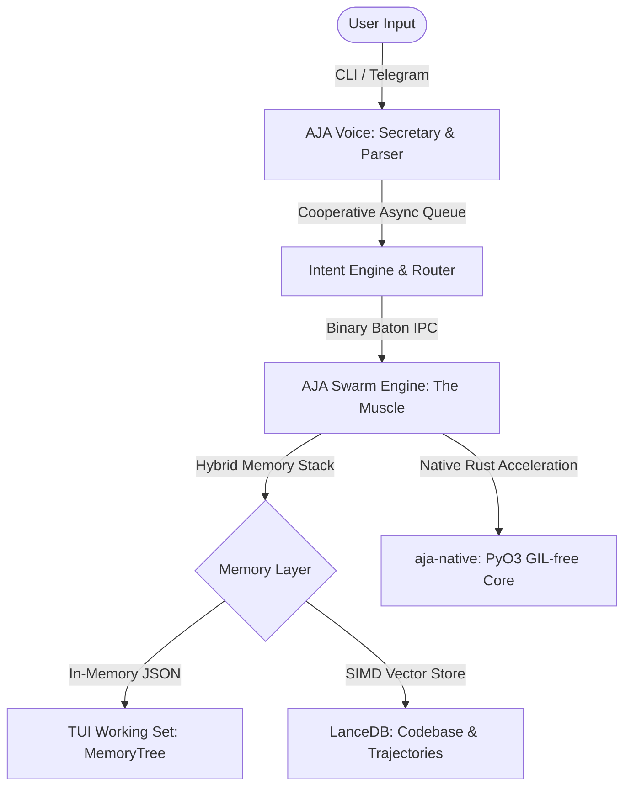

# AJA & AJA
### *The High-Performance Local-First Agentic OS*

[](https://www.python.org/)
[](https://www.rust-lang.org/)
[](https://arrow.apache.org/)
[]()
[](https://opensource.org/licenses/MIT)

**High-Performance Autonomy for Every Machine.**

AJA is a high-performance orchestration core designed for autonomous swarm intelligence. While AJA handles the heavy lifting—native Rust execution, Arrow memory structures, and planning graphs—**AJA** (Assistant of Joint Agents) acts as your personal natural-language secretary, planning missions and managing your workflow via TUI, Telegram, or WebSockets.



### 🧠 The Logic Flow:
- **LLM**: The Brain (Reasoning & Action Decisions).
- **AJA**: The Voice (Cooperative UI, Fail-Secure Telegram Gateway, FastAPI WebSocket Bridge).
- **AJA**: The Muscle (Native Execution, High-Speed Serialization, & Swarm Performance).

---

## 🎯 Our Mission: Performance Without Compromise
We believe that high-performance autonomous orchestration should not be a luxury reserved for multi-GPU clusters. AJA is engineered from the ground up to:
- **Democratize Autonomy**: Run efficiently on standard consumer-grade hardware with zero performance degradation.
- **Local-First Security**: Keep your state, memories, and codebase credentials local and auditable.
- **Extreme Efficiency**: Utilize Rust-native acceleration and columnar binary state structures to maximize every CPU cycle.

---

## 🏗️ Project Structure
AJA is organized as a clean, modular monorepo:
- **`libs/aja-core`**: The primary Python package (`aja.*`). Contains the engine, memory caching, TUI interface, and planning logic.
- **`packages/aja-native`**: High-performance Rust extension compiled via `maturin` and `PyO3` into a binary `.whl` targeting Python 3.12.
- **`apps/`**: High-level applications, including the React Executive Dashboard.
- **`tests/`**: Centralized test suite — 119 high-speed Python unit and system tests, all passing under Python 3.12.10.
- **`.aja/`**: Local-first storage directory containing LanceDB tables, state logs, and binary mission batons.
- **`docs/`**: Comprehensive technical documentation covering all architectural phases.

---

## 🏗️ The Pure AJA Architecture

### 1. Hybrid Memory Stack (LanceDB + MemoryTree)
To eliminate latency bottlenecks, AJA uses a dual-tiered cache-backed data store:
- **Conversational Working Set (`MemoryTree`)**: Conversational histories and active TUI interactions are kept in-memory for instant read/write performance.
- **Columnar Semantic Memory (`VectorMemory` & `AJAMemory`)**: Long-term trajectories and indexed codebases are offloaded to **LanceDB**, performing SIMD-accelerated vector lookups via local sentence-transformers.
- **Real-Time Mirroring**: Synchronizes conversational working sets instantly into a columnar `aja_chat_history` LanceDB table for persistent analytics and immediate RAG access.
 
### 2. Native Rust Nervous System (`aja-native`)
Performance-critical components are compiled into a native Rust extension using `PyO3`:
- **GIL-Free Execution**: Token calculations, semantic database directory initializations, and binary serialization bypass the Python Global Interpreter Lock.
- **Arrow C-Data Integration**: High-speed schema conversions utilize native Arrow structures for massive throughput.
 
### 3. Arrow Binary Baton Protocol
 Swarm coordination uses a specialized binary **Baton Protocol**. When a sub-agent is spawned or a task is handed over:
- State dictionaries are serialized into **Apache Arrow Tables** via `pyarrow`.
- **Zero-Copy Memory-Mapped Handover**: Uses `pyarrow.memory_map` in `BatonManager` to map baton state files directly into physical memory, bypassing slow file read cycles and row-by-row dictionary instantiations for near-instant handover.
- **Trace ID Propagation**: Active `trace_id` values are automatically serialized into Arrow metadata headers during capture and restored during pickup, enabling full end-to-end observability across baton handovers.
- Includes a compiled, native PyO3 binary fallback to `aja_native.read_baton` for maximum execution safety across mixed environments.
 
---
 
## 🤖 Meet AJA (The Hacker Butler)
While **AJA** is the high-performance engine, **AJA** is your elite, local-first conversational interface. Styled with a highly natural, developer-fluent **Hacker Butler / Secretary** persona, AJA is your personal coordinator who:
- **Polite & Proactive Executive Assistant**: Delivers structured developer briefings, plans meetings, schedules tasks, and coordinates obligations with elegant, concise, and witty communication.
- **Plans & Delegates**: Translates your natural language intent into structured missions for the AJA swarm.
- **Cooperative Async Telemetry**: Leverages an in-memory Pub/Sub event broker and asyncio queues to run non-blocking UI and telemetry tasks.
- **Fail-Secure System Safeguard**: Features the **AJA Guard** to audit every shell command before execution. If safety thresholds are violated, it triggers an AI risk analysis gate. Remote Telegram controls are strictly fail-secure (deny-by-default).
- **Real-time Mobile Sync**: Keeps your mobile device in sync with local system states using a FastAPI-powered WebSocket bridge (`/ws/mobile`).
 
---
 
## ⚡ Autonomous Overdrive (Max Powers)
AJA has been upgraded with **AJA Overdrive** capabilities, moving beyond simple task management into true autonomous engineering:
 
### 📂 Deep Territory RAG (Codebase Awareness)
The engine features a recursive `TerritoryScanner` (configured via `aja.json`) that indexes specified directories into a LanceDB vector store.
- Indexes code chunks using a **line-aware chunking strategy** to preserve code block syntax integrity.
- Leverages local `SentenceTransformer` models, falling back to a deterministic 384D SHA-256 hash vector generator if external libraries are missing.
 
### 🔧 Autonomous Tool Loop
The swarm does not just plan—it acts. Using the `ToolExecutor`, AJA can autonomously execute shell commands during its planning phase to verify environment state, list directories, check logs, or inspect dependencies, providing a self-correcting execution loop.
 
### 🧠 Synthetic Skill Library (Reflective Learning)
The `ReflectionEngine` audits every completed mission. If it identifies a successful pattern:
- It extracts a reusable **Synthetic Skill** and stores it in the `SkillStore`.
- If a pattern is repeated 3 times, it triggers a **self-building cycle** to dynamically synthesize and compile a custom tool to automate the workflow.
 
### 🛡️ Self-Healing HTN (Plan Hardening)
AJA features a rigorous structural validation layer for its Hierarchical Task Network plan graph inside `dag_validator.py`:
- **DAG Verification**: Enforces unique node IDs, cycle detection using Kahn's algorithm, and referential integrity of HTN sub-trees.
- **State-Flow Verification**: Simulates the state transitions of the plan, checking that all preconditions match the effects of upstream nodes, and detecting state assignment contradictions before execution.
- **Automated HTN Healer**: Dynamically heals malformed LLM plans in-place by breaking cyclic back-edges, stripping invalid primitive children, expanding compound node dependencies into leaf primitives, and automatically injecting preceding write effects to satisfy downstream preconditions.

---

## 🆕 Product-Readiness Upgrades (Latest)

These six core enterprise enhancements were implemented to bring AJA to full product-readiness:

### ✅ 1. Pydantic Configuration Validation
- [config_schema.py](libs/aja-core/aja/config_schema.py) defines strict models for all `aja.json` keys.
- [config.py](libs/aja-core/aja/config.py) validates on every import. Invalid configs produce clean warnings and fall back to safe defaults — no silent failures.

### ✅ 2. Trace-Aware Observability
- `TraceContextManager` in [telemetry.py](libs/aja-core/aja/observability/telemetry.py) tracks trace IDs across threads and async tasks using Python `contextvars`.
- `BatonManager` in [handover.py](libs/aja-core/aja/runtime/handover.py) auto-serializes `trace_id` into Arrow metadata headers during capture, and restores them during pickup.

### ✅ 3. Resilient Systems Diagnostics (`aja doctor`)
- [diagnostics.py](libs/aja-core/aja/utils/diagnostics.py) checks config schema validity, native Rust engine, LanceDB tables, API credentials, and system resources.
- `psutil` is a **soft dependency** — falls back gracefully to `os.cpu_count()` and `shutil.disk_usage()` if not installed.

### ✅ 4. Guided Setup Wizard (`aja setup`)
- Interactive `rich`-prompt onboarding inside [main.py](libs/aja-core/aja/main.py) scaffolds `aja.json`, `.env` keys, and LanceDB folder layout.

### ✅ 5. Safe Dry-Run Simulation (`--dry-run`)
- Full plan simulation without executing shell commands or mutating state.
- Every command is audited through `AJAGuard` safety classification.
- Falls back to a safe simulated plan if LLM is offline or unauthenticated.

### ✅ 6. Premium Hacker-Butler Conversational Persona
- Refactored prompt layouts in the chat gateway (`bridge.py`), intent parser (`intent_parser.py`), and swarm orchestrator (`orchestrator.py`) to form a polite, natural **Hacker Butler & Secretary** persona.
- Acts as a proactive task executive: coordinates schedules and calendars, summarizes code status/obligations, and presents clean structural developer briefings.

---
 
## 🛠️ Technology Stack
- **Core Engine**: Python 3.12.10 (Global Install — `C:\Users\Asus\AppData\Local\Programs\Python\Python312\python.exe`)
- **Performance Layer**: Rust-native acceleration via `PyO3` & `maturin`
- **Memory Stack**: Apache Arrow & LanceDB (SIMD-accelerated)
- **Configuration**: Pydantic v2 schema validation
- **Safety Layer**: AJA Guard (Command auditing & fail-secure filters) + Security audit logs
- **Observability**: `TraceContextManager` with Arrow Baton trace propagation
- **TUI/CLI**: Interactive terminal console utilizing `prompt_toolkit`, `rich`, and virtual Kanban boards.
- **Dashboard**: React 19 Executive Command Center

---

## 🚀 Getting Started

> **⚠️ Important**: Always use the project's **global Python 3.12.10** installation.  
> Path: `C:\Users\Asus\AppData\Local\Programs\Python\Python312\python.exe`  
> Do **not** use Anaconda Python or any virtual environment Python.

### 1. Run Setup Wizard (First Time)
Scaffold your configuration, API keys, and workspace folders interactively.
```powershell
$env:PYTHONPATH="libs/aja-core"; & "C:\Users\Asus\AppData\Local\Programs\Python\Python312\python.exe" -m aja setup
```

### 2. Run System Diagnostics
Verify your environment is fully configured and all subsystems are healthy.
```powershell
$env:PYTHONPATH="libs/aja-core"; & "C:\Users\Asus\AppData\Local\Programs\Python\Python312\python.exe" -m aja doctor
```

### 3. Launch AJA Chat
Interact with your assistant and manage the swarm through a premium conversational loop.
```powershell
$env:PYTHONPATH="libs/aja-core"; & "C:\Users\Asus\AppData\Local\Programs\Python\Python312\python.exe" -m aja chat
```

### 4. Dispatch Missions
Delegate complex objectives directly to the SwarmEngine.
```powershell
$env:PYTHONPATH="libs/aja-core"; & "C:\Users\Asus\AppData\Local\Programs\Python\Python312\python.exe" -m aja run "Audit the project security and implement missing guardrails"
```

### 5. Safe Dry-Run Simulation
Preview what the swarm would do without executing any commands.
```powershell
$env:PYTHONIOENCODING="utf-8"; $env:PYTHONPATH="libs/aja-core"; & "C:\Users\Asus\AppData\Local\Programs\Python\Python312\python.exe" -m aja run "Perform project analysis" --dry-run
```

### 6. Monitor Swarm Health
View real-time metrics and active baton handoffs across the Arrow memory stack.
```powershell
$env:PYTHONPATH="libs/aja-core"; & "C:\Users\Asus\AppData\Local\Programs\Python\Python312\python.exe" -m aja status
```

### 7. Run Unit Tests
```powershell
$env:PYTHONPATH="libs/aja-core"; & "C:\Users\Asus\AppData\Local\Programs\Python\Python312\python.exe" -m pytest tests/python
```
**Expected result**: `119 passed, 1 warning`

---

## 📜 Philosophy
Performance is not a luxury—it is an engineering requirement. AJA proves that by prioritizing **Memory Efficiency**, **Native Execution**, **Fail-Secure Security**, and **Trace-Aware Observability**, we can deliver world-class autonomous systems on the hardware you already own.
