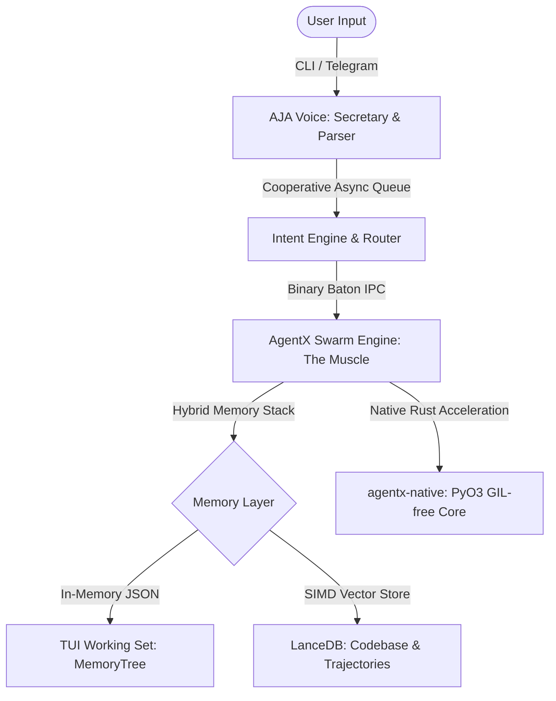

# AgentX & AJA
### *The High-Performance Local-First Agentic OS*

[](https://www.python.org/)
[](https://www.rust-lang.org/)
[](https://arrow.apache.org/)
[](https://opensource.org/licenses/MIT)

**High-Performance Autonomy for Every Machine.**

AgentX is a high-performance orchestration core designed for autonomous swarm intelligence. While AgentX handles the heavy lifting—native Rust execution, Arrow memory structures, and planning graphs—**AJA** (Assistant of Joint Agents) acts as your personal natural-language secretary, planning missions and managing your workflow via TUI, Telegram, or WebSockets.



### 🧠 The Logic Flow:
- **LLM**: The Brain (Reasoning & Action Decisions).
- **AJA**: The Voice (Cooperative UI, Fail-Secure Telegram Gateway, FastAPI WebSocket Bridge).
- **AgentX**: The Muscle (Native Execution, High-Speed Serialization, & Swarm Performance).

---

## 🎯 Our Mission: Performance Without Compromise
We believe that high-performance autonomous orchestration should not be a luxury reserved for multi-GPU clusters. AgentX is engineered from the ground up to:
- **Democratize Autonomy**: Run efficiently on standard consumer-grade hardware with zero performance degradation.
- **Local-First Security**: Keep your state, memories, and codebase credentials local and auditable.
- **Extreme Efficiency**: Utilize Rust-native acceleration and columnar binary state structures to maximize every CPU cycle.

---

## 🏗️ Project Structure
AgentX is organized as a clean, modular monorepo:
- **`libs/agentx-core`**: The primary Python package (`agentx.*`). Contains the engine, memory caching, TUI interface, and planning logic.
- **`packages/agentx-native`**: High-performance Rust extension compiled via `maturin` and `PyO3` into a binary `.whl` targeting Python 3.12.
- **`apps/`**: High-level applications, including the React Executive Dashboard.
- **`tests/`**: Centralized test suite containing 111 high-speed Python unit and system tests.
- **`.agentx/`**: Local-first storage directory containing LanceDB tables, state logs, and binary mission batons.

---

## 🏗️ The Pure AgentX Architecture

### 1. Hybrid Memory Stack (LanceDB + MemoryTree)
To eliminate latency bottlenecks, AgentX uses a dual-tiered cache-backed data store:
- **Conversational Working Set (`MemoryTree`)**: Conversational histories and active TUI interactions are kept in-memory for instant read/write performance.
- **Columnar Semantic Memory (`VectorMemory` & `AJAMemory`)**: Long-term trajectories and indexed codebases are offloaded to **LanceDB**, performing SIMD-accelerated vector lookups via local sentence-transformers.
- **Real-Time Mirroring**: Synchronizes conversational working sets instantly into a columnar `aja_chat_history` LanceDB table for persistent analytics and immediate RAG access.
 
### 2. Native Rust Nervous System (`agentx-native`)
Performance-critical components are compiled into a native Rust extension using `PyO3`:
- **GIL-Free Execution**: Token calculations, semantic database directory initializations, and binary serialization bypass the Python Global Interpreter Lock.
- **Arrow C-Data Integration**: High-speed schema conversions utilize native Arrow structures for massive throughput.
 
### 3. Arrow Binary Baton Protocol
 Swarm coordination uses a specialized binary **Baton Protocol**. When a sub-agent is spawned or a task is handed over:
- State dictionaries are serialized into **Apache Arrow Tables** via `pyarrow`.
- **Zero-Copy Memory-Mapped Handover**: Uses `pyarrow.memory_map` in `BatonManager` to map baton state files directly into physical memory, bypassing slow file read cycles and row-by-row dictionary instantiations for near-instant handover.
- Includes a compiled, native PyO3 binary fallback to `agentx_native.read_baton` for maximum execution safety across mixed environments.
 
---
 
## 🤖 Meet AJA (Assistant to the Joint Agents)
While **AgentX** is the high-performance engine, **AJA** is your interface. She is the conversational operator who:
- **Plans & Delegates**: Translates your natural language intent into structured missions for the AgentX swarm.
- **Cooperative Async Telemetry**: Leverages an in-memory Pub/Sub event broker and asyncio queues to run non-blocking UI and telemetry tasks.
- **Fail-Secure System Safeguard**: Features the **AJA Guard** to audit every shell command before execution. If safety thresholds are violated, it triggers an AI risk analysis gate. Remote Telegram controls are strictly fail-secure (deny-by-default).
- **Real-time Mobile Sync**: Keeps your mobile device in sync with local system states using a FastAPI-powered WebSocket bridge (`/ws/mobile`).
 
---
 
## ⚡ Autonomous Overdrive (Max Powers)
AgentX has been upgraded with **AJA Overdrive** capabilities, moving beyond simple task management into true autonomous engineering:
 
### 📂 Deep Territory RAG (Codebase Awareness)
The engine features a recursive `TerritoryScanner` (configured via `agentx.json`) that indexes specified directories into a LanceDB vector store.
- Indexes code chunks using a **line-aware chunking strategy** to preserve code block syntax integrity.
- Leverages local `SentenceTransformer` models, falling back to a deterministic 384D SHA-256 hash vector generator if external libraries are missing.
 
### 🔧 Autonomous Tool Loop
The swarm does not just plan—it acts. Using the `ToolExecutor`, AgentX can autonomously execute shell commands during its planning phase to verify environment state, list directories, check logs, or inspect dependencies, providing a self-correcting execution loop.
 
### 🧠 Synthetic Skill Library (Reflective Learning)
The `ReflectionEngine` audits every completed mission. If it identifies a successful pattern:
- It extracts a reusable **Synthetic Skill** and stores it in the `SkillStore`.
- If a pattern is repeated 3 times, it triggers a **self-building cycle** to dynamically synthesize and compile a custom tool to automate the workflow.
 
### 🛡️ Self-Healing HTN (Plan Hardening)
AgentX features a rigorous structural validation layer for its Hierarchical Task Network plan graph inside `dag_validator.py`:
- **DAG Verification**: Enforces unique node IDs, cycle detection using Kahn's algorithm, and referential integrity of HTN sub-trees.
- **State-Flow Verification**: Simulates the state transitions of the plan, checking that all preconditions match the effects of upstream nodes, and detecting state assignment contradictions before execution.
- **Automated HTN Healer**: Dynamically heals malformed LLM plans in-place by breaking cyclic back-edges, stripping invalid primitive children, expanding compound node dependencies into leaf primitives, and automatically injecting preceding write effects to satisfy downstream preconditions.
 
---

## 🛠️ Technology Stack
- **Core Engine**: Python 3.12+ (Modular & Async-First)
- **Performance Layer**: Rust-native acceleration via `PyO3` & `maturin`
- **Memory Stack**: Apache Arrow & LanceDB (SIMD-accelerated)
- **Safety Layer**: AJA Guard (Command auditing & fail-secure filters)
- **TUI/CLI**: Interactive terminal console utilizing `prompt_toolkit`, `rich`, and virtual Kanban boards.
- **Dashboard**: React 19 Executive Command Center

---

## 🚀 Getting Started

### 1. Launch AJA Chat
Interact with your assistant and manage the swarm through a premium conversational loop.
```bash
python -m agentx chat
```

### 2. Dispatch Missions
Delegate complex objectives directly to the SwarmEngine.
```bash
python -m agentx run "Audit the project security and implement missing guardrails"
```

### 3. Monitor Swarm Health
View real-time metrics and active baton handoffs across the Arrow memory stack.
```bash
python -m agentx status
```

---

## 📜 Philosophy
Performance is not a luxury—it is an engineering requirement. AgentX proves that by prioritizing **Memory Efficiency**, **Native Execution**, and **Fail-Secure Security**, we can deliver world-class autonomous systems on the hardware you already own.
