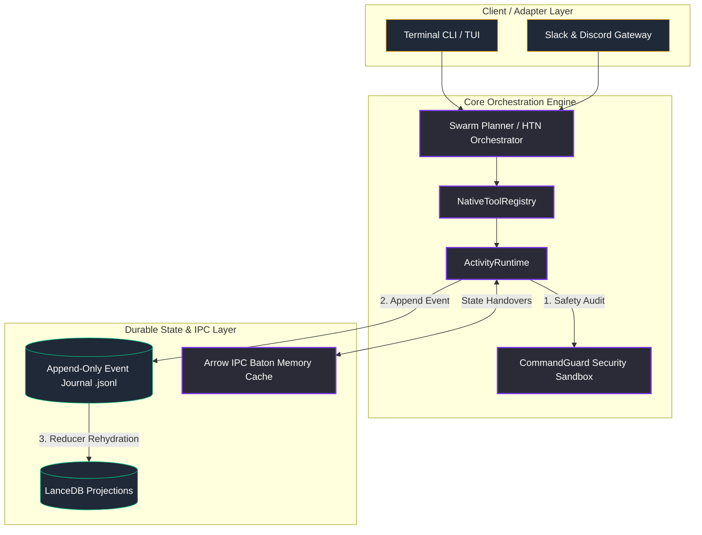
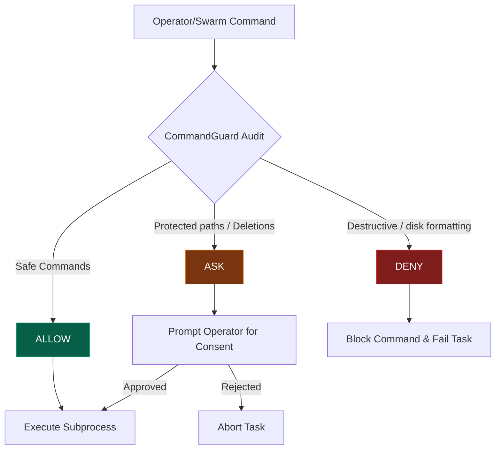

# AJA

**The Ambient Autonomous Cognitive Agent OS & Replay-Authoritative Execution Kernel.**

[](https://opensource.org/licenses/MIT)
[](https://pyo3.rs/)
[](https://www.python.org/downloads/release/python-3120/)
[](https://arrow.apache.org/)
[](https://lancedb.github.io/lancedb/)

AJA is an ambient autonomous cognitive operating system and execution substrate. Built on frontier agent research (**Bi-Temporal Knowledge Graphs**, **System-2 Test-Time Compute**, **CoALA 2.0**, **AIOS**, **CodeAct**, and **Stateless Model Context Protocol**), AJA operates as a persistent system companion capable of managing multiple projects, executing prioritized background task queues, and running self-directed sysadmin, coding, and research missions safely across local machines and cloud VPS nodes.

---

## What AJA Is

AJA treats agentic workflows as long-running, durable compute processes rather than ephemeral chat loops.

* **Ambient Autonomous Agent OS**: Operates host-wide with zero setup ceremony—diagnosing servers, managing containers, fetching technical research, and refactoring repositories.
* **Bi-Temporal Knowledge Graph Memory**: Tracks dual timelines (`valid_time` vs `transaction_time`) in SQLite FTS5 + LanceDB vector tables with non-destructive cascade invalidation.
* **System-2 Test-Time Compute (TTC)**: Performs pre-mutation candidate branch exploration, rollout simulations, and automatic state-tree rewinds upon step failures.
* **Autonomous Skill Self-Evolution (`agentskills.io`)**: Automatically compiles winning multi-step trajectories into reusable, verified skills under `~/.aja/skills/`.
* **Universal Stateless MCP Mesh**: Dynamically connects to local and remote MCP servers via STDIO / Streamable HTTP with `maxTokenBudget` context protection.
* **CodeAct Action Engine**: Direct Python and Bash execution with sandbox timeout traps and empirical output verification.
* **Multi-Workspace Kernel (`aja ws`)**: Dynamically manages isolated project contexts, LRU memory pools, and priority task queues (`URGENT`, `NORMAL`, `BACKGROUND`).
* **Replay-Authoritative Durable Execution**: State is strictly derived from an append-only `.jsonl` event journal, guaranteeing deterministic recovery from crashes or reboots.

---

## Why AJA Exists

Most autonomous agent frameworks are repository-bound IDE plugins or fragile prompt chains. This results in:
* **Repo-Locked Isolation**: Inability to manage the host system, inspect Docker daemons, or execute cross-project workflows.
* **Brittle Tool Schemas**: Multi-step JSON tool-calling loops that fail on complex calculations or data transformations.
* **Single-Store Memory Drift**: Storing exact system facts (ports, IPs) in vector databases where fuzzy matching causes hallucinations.
* **Crash Amnesia**: Workflows that restart from zero when an API call times out or a process crashes.

AJA inverts this paradigm with a robust, research-backed cognitive operating system.

---

## Key Features

| Feature | Description |
|---------|-------------|
| **Bi-Temporal Graph Memory** | Dual-timeline SQLite FTS5 knowledge graph (`valid_time` vs `transaction_time`) eliminating vector memory collisions. |
| **System-2 TTC Planner** | Test-Time Compute candidate branch exploration with state-tree snapshots and automatic failure backtracking. |
| **Autonomous Skill Compiler** | Self-evolution engine compiling successful mission trajectories into executable `agentskills.io` skills in `~/.aja/skills/`. |
| **Universal Stateless MCP Mesh** | Stateless MCP client supporting dynamic `tools/list` discovery and `maxTokenBudget` context safety. |
| **CodeAct Action Engine** | Direct Python & Bash execution with timeout traps, markdown extraction, and stdout/stderr capture. |
| **Tiered SOUL.md Architecture** | Custom global (`~/.aja/SOUL.md`) and project (`.aja/SOUL.md`) personas layered over `AGENTS.md` guidelines. |
| **Magentic-One Specialists** | Lead Cognitive Orchestrator directing specialized sub-agents: `SysAdmin`, `WebResearcher`, and `CodeEngineer`. |
| **Multi-Workspace Kernel** | Coroutine-isolated `WorkspaceContext`, dynamic registry (`~/.aja/workspaces.json`), and priority async mission queue. |
| **Replay-Authoritative Orchestration** | Append-only `.jsonl` journal is the single source of truth. All runtime state is a derived projection. |
| **Durable Activities** | Temporal-style activity context managers intercepting live execution and replaying historical results during recovery. |
| **Ambient & Sandboxed Security** | Ambient Host Mode for system-wide triage vs. Sandboxed Workspace Mode with hard non-bypassable catastrophic blocks. |
| **Telegram Remote Gateway** | Full multi-workspace remote operations via Telegram (`/workspaces`, `/switch`, `@project <mission>`). |
| **Rust Acceleration (PyO3/Arrow)** | Zero-copy inter-process communication for state transfer via Apache Arrow baton caches. |
| **Operator Tooling** | Built-in CLI for diagnostics (`aja doctor`), workspaces (`aja ws`), setup (`aja setup`), and projection rebuilding. |

---

## Quick Install

AJA uses a unified `maturin` build system to compile the Rust native extensions and install the Python runtime simultaneously.

### Prerequisites
* Python 3.11+
* Rust Stable Toolchain

### Installation

```bash
# Clone the repository
git clone https://github.com/your-org/aja.git
cd aja

# Build and install the unified package in editable mode
pip install -e ".[all]"
```

> [!NOTE]
> On Windows host machines, installing AJA with the `all` or `pty-win` optional dependencies (e.g. `pip install -e ".[all]"`) is required to install the `pywinpty` library. If omitted, the Windows execution transport will fallback to standard pipe-based streams rather than native ConPTY.

Verify the installation and runtime dependencies:
```bash
python -m aja doctor
```

---

## Quick Start

Clone -> install -> chat in under 10 minutes.

### One-liners

**Linux / macOS:**
```bash
git clone https://github.com/your-org/aja.git && cd aja && bash scripts/quickstart.sh
```

**Windows (PowerShell):**
```powershell
git clone https://github.com/your-org/aja.git; cd aja; .\scripts\quickstart.ps1
```

The script creates a `.venv`, installs AJA (`pip install -e ".[telegram]"`), walks you through your Telegram bot token and user allowlist (written to `.env`), runs `aja doctor` to validate everything, and prints next steps.

### Prerequisites

* **Python 3.11+** - [python.org/downloads](https://www.python.org/downloads/)
* **A Telegram bot token** - create a bot with [@BotFather](https://t.me/BotFather)
* **Your Telegram user id** - message [@userinfobot](https://t.me/userinfobot); required for the security allowlist (without it, the gateway fail-safe denies all remote users)

### What You Get

* **Chat from anywhere** - `aja serve` connects the full agent runtime to your private Telegram bot, restricted to your user id.
* **Autonomous missions** - self-directed sysadmin, web research, and coding tasks executed on your machine with replay-safe durability.
* **Safety by default** - `CommandGuard` catastrophic-command denial, permission scopes, and workspace sandboxing validated by `aja doctor`.
* **Persistent memory** - bi-temporal knowledge graph + episodic vector memory that survives restarts.

Prefer manual setup? Run the interactive configuration wizard:

```bash
python -m aja setup
```

Then run a dry-run simulation to audit potential shell executions against safety blocks without mutating local files:

```bash
python -m aja run "Perform repository analysis" --dry-run
```

And inspect replay history - the deterministic execution timeline for past sessions:

```bash
python -m aja exec list
python -m aja exec timeline <session_id>
```

---

## Getting Started: Durable Activities

Workflows in AJA run under `ActivityRuntime`, which intercepts and journals execution steps. When an execution fails or is replayed, the runtime skips already-completed tasks (idempotency) and only runs the remaining steps.

Here is how you define and execute activities in AJA:

```python
import asyncio
from aja.orchestration.activity_rt import ActivityRuntime, Activity, ActivityType, RetryPolicy
from aja.runtime.mission_journal import MissionJournal

async def run_mission():
    # 1. Initialize the event journal for the mission
    journal = MissionJournal(mission_id="gpu-profile-001")
    runtime = ActivityRuntime(journal=journal)
    
    # 2. Define an activity (e.g., executing a python function or shell command)
    activity = Activity(
        tool="run_shell_command",
        args={"cmd": "nvidia-smi --query-gpu=memory.total --format=csv"},
        activity_type=ActivityType.SHELL,
        trace_id="trace-gpu-verify",
        retry_policy=RetryPolicy.SAFE
    )
    
    # 3. Execute the activity durably
    result = await runtime.run(activity)
    print(f"Total GPU Memory: {result.stdout.strip()}")

if __name__ == "__main__":
    asyncio.run(run_mission())
```

During a crash recovery or replay, AJA will load the journal for `"gpu-profile-001"`, see that `trace-gpu-verify` completed successfully, and bypass the shell execution entirely—returning the cached value instantly.


---

## CLI Command Suite

AJA provides a comprehensive CLI for managing autonomous operations, execution sessions, and system health.

* **`aja run <objective>`**: Execute an autonomous mission. Supports `--dry-run` for safe simulation and background execution.
* **`aja chat`**: Launch the interactive conversational assistant loop. Features a built-in Kanban task manager and slash commands.
* **`aja pickup <code>`**: Resume a mission from a high-performance Apache Arrow baton transfer.
* **`aja status`**: Real-time overview of swarm health, active batons, and pending LanceDB tasks.
* **`aja exec <subcommand>`**: Inspect and manage canonical execution sessions.
  * `list`: List all execution sessions and their states.
  * `show / timeline`: Inspect the events and artifact manifests of a session.
  * `diff`: Show the JSON diff of changes made during an execution.
  * `apply`: Validate and safely apply patch diffs from an isolated execution workspace to the main project using `git apply`.
  * `replay`: Visually replay the events of a session in a TUI viewer (`replay_viewer`).
* **`aja doctor`**: Run system health checks (CPU, RAM, GPU, native modules).
* **`aja setup`**: Interactive wizard to scaffold configuration and data directories.

### Interactive TUI Commands (Inside `aja chat`)

When inside the interactive `aja chat` loop, you can use the following slash commands to direct the autonomous engine:

*   **`/swarm <objective>`**: Execute a foreground multi-agent mission. The Planner decomposes the task, dispatches worker processes with Apache Arrow batons, and executes tasks using the native tool calling loop.
*   **`/goal <objective>`**: Run a persistent background mission. Operates as a detached process on the host OS, persisting through terminal exits and system restarts.
*   **`/schedule`**: Interactively schedules a recurring task using cron or interval expressions (e.g., `every 1h`, `0 0 * * *`) that runs automatically in the background.
*   **`/kanban` / `/live`**: Renders a terminal-based Kanban board displaying the status of active and historical tasks.
*   **`/todo <title>` / `/doing <id>` / `/done <id>`**: Add and transition tasks across Kanban statuses.
*   **`/status`**: Display system status, active baton states, and pending LanceDB tasks.
*   **`/doctor`**: Run environment and configuration integrity diagnostics.
*   **`/models`**: Interactively view or swap Planner vs. Worker model assignments on the fly.

---

## Architecture Overview

AJA enforces a strict separation between orchestration, durable persistence, and execution transport.


```mermaid
graph TD
    classDef core fill:#2a2b36,stroke:#7c3aed,stroke-width:2px,color:#fff;
    classDef storage fill:#1f2937,stroke:#10b981,stroke-width:1px,color:#fff;
    classDef client fill:#1f2937,stroke:#f59e0b,stroke-width:1px,color:#fff;

    subgraph Client / Adapter Layer
        CLI[Terminal CLI / TUI]:::client
        Gateway[ Slack & Discord Gateway ]:::client
    end

    subgraph Core Orchestration Engine
        Orch[Swarm Planner / HTN Orchestrator]:::core
        Registry[NativeToolRegistry]:::core
        RT[ActivityRuntime]:::core
        Guard[CommandGuard Security Sandbox]:::core
    end

    subgraph Durable State & IPC Layer
        Journal[(Append-Only Event Journal .jsonl)]:::storage
        Projections[(LanceDB Projections)]:::storage
        Baton[Arrow IPC Baton Memory Cache]:::core
    end

    CLI --> Orch
    Gateway --> Orch
    Orch --> Registry
    Registry --> RT
    RT -->|1. Safety Audit| Guard
    RT -->|2. Append Event| Journal
    Journal -->|3. Reducer Rehydration| Projections
    RT <-->|State Handovers| Baton
```

* **Orchestration Layer**: Manages the deterministic sequencing of tasks and handles control flow, acting as the primary state machine.
* **Durable Activity Layer**: Wraps side-effecting code. During normal execution, it runs the code and journals the result. During recovery, it returns the journaled result without re-executing.
* **Journal & Replay Layer**: The append-only `.jsonl` event log acts as the absolute authority. The `EventRehydrator` replays this log to reconstruct state.
* **Projection Layer**: LanceDB read-projections are deterministically built from the journal. They serve fast state queries but hold no authority.
* **Execution Transport Layer**: Provides process isolation via PTY orchestration, safely running commands and capturing `stdout`/`stderr` lineage.
* **Rust Acceleration Layer**: Handles heavy serialization and state transport using Apache Arrow IPC batons, bypassing Python's GIL for core I/O.

---

## Cognitive Memory & Evaluation Systems

AJA implements production-grade memory safety and validation architectures to guarantee long-term operational consistency and prevent failures.

### Multi-Tier Cognitive Memory Stack
AJA's memory architecture is split into four cognitive layers, leveraging LanceDB as an embedded serverless vector database and Apache Arrow for fast retrieval:
* **Short-Term Memory**: Conversation history (`aja_chat_history`) and RAM-cached, thread-safe baton transfer buffers (`_IN_MEMORY_BATONS`) enabling sub-millisecond execution handovers.
* **Episodic Memory**: Complete historical executions of tasks and tool outputs stored inside `core_tasks` and `core_tool_executions`.
* **Semantic Memory**: Cosine similarity goal-search over standard 384-dimensional plan spaces (`core_plans`) using metadata-first SQL pre-filtering (`.where()`) at the database layer.
* **Procedural Memory**: Rule triggers (`core_triggers`), strategy stores (`ExperienceStore`) with temporal decay scoring ($e^{-\lambda t}$), and failure post-mortem mapping (`FailureMemory`) to avoid repeating failed plan configurations.
* **Stability Guard**: Automatically disables planning learning if the rolling task success rate drops below `40%`, isolating the planning engine from junk context loops.

### Agent Evaluation Harness
An automated validation suite (`scripts/eval_harness.py`) profiles model performance and safeguards behavioral contracts:
* **Format Compliance & Stability**: Measures average latencies and verifies that LLM outputs remain 100% JSON compliant under reasoning pretext and Markdown fence drifting.
* **Adversarial Resilience**: Audits and blocks prompt injection payloads (e.g. `format c:`), mapping attacks to benign conversation nodes.

---

## Durable Execution Model

The core invariant of AJA is **replay determinism**. 


```mermaid
graph TD
    classDef allow fill:#065f46,stroke:#059669,stroke-width:1px,color:#fff;
    classDef ask fill:#78350f,stroke:#d97706,stroke-width:1px,color:#fff;
    classDef deny fill:#7f1d1d,stroke:#dc2626,stroke-width:1px,color:#fff;

    Command[Operator/Swarm Command] --> Guard{CommandGuard Audit}
    
    Guard -->|Safe Commands| Allow[ALLOW]:::allow
    Guard -->|Protected paths / Deletions| Ask[ASK]:::ask
    Guard -->|Destructive / disk formatting| Deny[DENY]:::deny

    Allow --> Run[Execute Subprocess]
    Ask --> Prompt[Prompt Operator for Consent]
    Prompt -->|Approved| Run
    Prompt -->|Rejected| Fail[Abort Task]
    Deny --> Block[Block Command & Fail Task]
```

1. **Event Sourcing**: When an execution step occurs, an event is atomically appended to the journal. The runtime state is then updated via a pure function reducer.
2. **Crash Recovery**: If the system crashes, AJA does not restart the workflow. Instead, it replays the journal.
3. **Durable Activities**: During replay, when the orchestrator encounters a previously completed side effect (e.g., a network call or shell command), the `ActivityContext` intercepts the call, prevents execution, and returns the historical result.
4. **Lineage Isolation**: Every task execution is strictly scoped. Output payloads, exit codes, and trace IDs are durably logged, ensuring perfect audibility.

---

## Repository Structure

```text
aja/
├── libs/
│   └── aja-core/               # Core Python Orchestration Runtime
│       ├── aja/runtime/        # Rehydrator, Journal, and Durable Activities
│       ├── aja/scheduler/      # Deterministic Cron Execution
│       └── aja/observability/  # TraceContextManager & Telemetry
├── packages/
│   └── aja-native/             # Rust acceleration layer (PyO3 + Apache Arrow)
├── tests/
│   └── python/                 # Pytest suite ensuring replay determinism
├── docs/                       # Architecture specs and operator manuals
├── tools/                      # Release and development tooling
└── pyproject.toml              # Unified Maturin build manifest
```

---

## Operator Tooling

AJA includes built-in operational tooling designed for systems engineers managing local environments.

* **`aja doctor`**: Validates the health of the host system, ensuring Rust native modules, vector stores, and required binaries are correctly mapped.
* **`aja rebuild-projections`**: Discards all read-only LanceDB tables and deterministically rebuilds them from the append-only journal.
* **`AJA_DATA_DIR`**: A strictly enforced environment boundary that contains all execution state, keeping the host system clean.
* **`aja tui`**: A local curses-based dashboard providing real-time visibility into the HTN (Hierarchical Task Network) DAG, tailing logs, and system metrics.

---

## Development & Contributing

### Local Setup
Ensure you have Python 3.12+ and Rust installed. 
```bash
pip install -e .[dev]
```

### Testing
AJA maintains a strict testing philosophy. Any change that breaks replay determinism is a failed build.
```bash
python -m pytest tests/python -v
```

### Replay Certification Philosophy
We treat backwards compatibility of the event journal as a strict requirement. When altering core execution logic, you must ensure that historical journals can still be cleanly rehydrated by the `VersionedEventRehydrator`.

---

## Roadmap

* **Replay Certification**: Formalized compliance tooling to verify older journals against newer schema definitions.
* **Snapshotting**: Periodic state snapshots to reduce replay time on infinitely running research daemons.
* **Deterministic Concurrency**: Multi-threaded durable activities with strictly ordered event interleaving.
* **Release Engineering**: Pre-compiled binary distributions for isolated installation without a local Rust toolchain.
* **Operational Hardening**: Granular network egress filtering and copy-on-write overlay filesystems for strict sandbox isolation.

---

## Acknowledgements

AJA draws architectural inspiration from modern durable execution systems like Temporal, robust event-sourced architectures, and the Dapr runtime philosophy.

---

## License

[MIT License](LICENSE)
