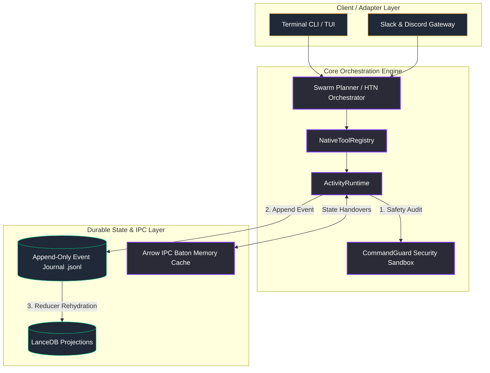
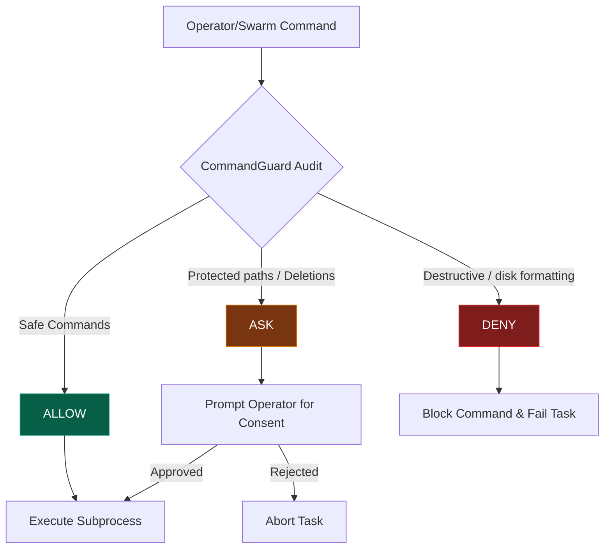

# AJA

**A local-first durable execution runtime and replay-authoritative orchestration substrate for autonomous systems.**

[](https://opensource.org/licenses/MIT)
[](https://pyo3.rs/)
[](https://www.python.org/downloads/release/python-3120/)
[](https://arrow.apache.org/)
[](https://lancedb.github.io/lancedb/)

AJA provides the execution infrastructure required to run autonomous workflows safely and deterministically on local hardware. It replaces fragile agentic scripts with a robust, event-sourced runtime that guarantees state persistence, deterministic replay, and crash-consistent recovery.

---

## What AJA Is

AJA is a systems-level orchestration substrate designed for autonomous operations. It treats agentic workflows as long-running, durable compute processes rather than ephemeral chat loops.

* **Local-First Durable Execution Runtime**: Ensures workflows can survive process restarts, system crashes, and network partitions without losing state.
* **Replay-Authoritative Orchestration**: The system state is strictly derived from an append-only execution journal. If it isn't in the journal, it didn't happen.
* **Event-Sourced Infrastructure**: Every decision, command, and side effect is durably journaled before execution, enabling deterministic reconstruction of any workflow.

With AJA, operators can build research daemons, local infrastructure automation, and scheduled workflows that run continuously for days, surviving machine reboots and gracefully recovering from failures.

---

## Why AJA Exists

Most autonomous agent frameworks prioritize prompt engineering and LLM chain logic, leaving execution infrastructure as an afterthought. This results in:
* **Fragile Scripts**: Workflows that restart from zero when an API call times out or a process crashes.
* **Nondeterministic Execution**: Unpredictable loops where state mutations are lost in memory.
* **Log-Only Observability**: Systems where debugging relies on grep-ing unstructured logs rather than inspecting deterministic execution graphs.

AJA exists to invert this model. It provides:
* **Deterministic Replay**: The ability to reconstruct exact execution states by replaying the event journal.
* **Crash Recovery**: Workflows resume exactly where they left off after a system interruption.
* **Durable Side Effects**: External mutations are wrapped in durable activities, ensuring they are executed exactly once.
* **Execution Lineage**: Strict isolation and auditable trails for every action taken by the system.

---

## Key Features

| Feature | Description |
|---------|-------------|
| **Replay-Authoritative Orchestration** | The append-only `.jsonl` journal is the single source of truth. All runtime state is a derived projection. |
| **Durable Activities** | Execution steps are wrapped in context managers that intercept live execution and safely replay historical results during recovery. |
| **Event-Sourced Rehydration** | Deterministically reconstruct state from zero. Any divergence between live execution and historical replay is treated as a fatal error. |
| **Rust Acceleration (PyO3/Arrow)** | High-performance, zero-copy inter-process communication for state transfer via Apache Arrow baton caches. |
| **PTY Execution Runtime** | Unified async I/O transport providing cooperative PTY orchestration (ConPTY on Windows, POSIX PTYs on Linux/macOS). |
| **Schema Versioning** | Forward-compatible event definitions ensuring historical journals can always be replayed safely as the platform evolves. |
| **Operator Tooling** | Built-in CLI for diagnostics (`aja doctor`), setup (`aja setup`), and rebuilding projections (`aja rebuild-projections`). |
| **Conversational Assistant** | Interactive conversational loop (`aja chat`) with slash commands, Kanban task management, and system diagnostics. |
| **Native Agentic Engine** | SwarmEngine acts as Manager, using strict JSON-schema tool calling via `NativeToolRegistry` to delegate to the Worker Loop safely without brittle shell parsing. |
| **Cognitive Memory Stack** | Layered memory (Short-term, Episodic, Semantic vector, and Procedural) built on LanceDB/Arrow with Stability Guards and temporal decay. |
| **Agent Evaluation Harness** | Level 3 automated statistical profiling, contract verification, and adversarial prompt-injection audit harness. |

---

## Quick Install

AJA uses a unified `maturin` build system to compile the Rust native extensions and install the Python runtime simultaneously.

### Prerequisites
* Python 3.11+
* Rust Stable Toolchain

### Installation

```bash
# Clone the repository
git clone https://github.com/your-org/aja.git
cd aja

# Build and install the unified package in editable mode
pip install -e ".[all]"
```

> [!NOTE]
> On Windows host machines, installing AJA with the `all` or `pty-win` optional dependencies (e.g. `pip install -e ".[all]"`) is required to install the `pywinpty` library. If omitted, the Windows execution transport will fallback to standard pipe-based streams rather than native ConPTY.

Verify the installation and runtime dependencies:
```bash
python -m aja doctor
```

---

## Quickstart

### 1. Initialize the Runtime
Initialize the runtime environment, which provisions the `AJA_DATA_DIR` and necessary LanceDB vector stores.

```bash
python -m aja setup
```
```text
$ python -m aja setup
===========================================================
               AJA INTERACTIVE SETUP WIZARD                
===========================================================
[✔] Verified Python 3.12.10 environment.
[✔] Verified PyO3 native extensions (aja_native).
[✔] Mapped default storage path: C:\Users\<Username>\AppData\Local\Anixes\AJA
[?] Enter default LLM Provider [default: openai]:
[?] Enter default Planner Model [default: gpt-4o]:
[?] Enter default Worker Model [default: claude-haiku-4.5]:
[✔] Initialized database table 'aja_missions' inside LanceDB.
[✔] Initialized database table 'aja_tasks' inside LanceDB.
===========================================================
               AJA CONFIGURED SUCCESSFULLY                 
===========================================================
```

### 2. Run a Simulated Workflow
Run a dry-run simulation to audit potential shell executions against safety blocks without mutating local files.

```bash
python -m aja run "Perform repository analysis" --dry-run
```
```text
┌──────────────────────── AJA Live HTN Plan Tree DAG ────────────────────────┐
│  ▼ Root Mission: Debug GPU memory leak                                     │
│    ├── ▼ Method: Profile CUDA memory allocation                            │
│    │     ├── [x] Run stress test with monitoring                           │
│    │     └── [/] Parse memory dump files                                   │
│    └── ├── ▼ Method: Analyze leak pattern                                   │
│    │     └── [ ] Locate reference cycle                                    │
│    └── └── [ ] Refactor PyTorch model cleanup code                         │
├────────────────────────────────────────────────────────────────────────────┤
│  Timeline Stream:                                                          │
│  [19:15:10] TOOL_CALLED: run_shell_command (python stress_test.py)         │
│  [19:15:12] PROCESS_SPAWNED: PID 20438                                     │
│  [19:15:13] METRICS: GPU memory utilization peaked at 92.4%                │
├────────────────────────────────────────────────────────────────────────────┤
│ Metrics: Duration: 0:02:13 | CPU: 12.4% | Memory: 4.2GB | Active Trace: 99 │
└─────────────────────────────────────── [s] Toggle Skin | [q] Quit ─────────┘
```

### 3. Inspect Replay History
View the deterministic execution timeline for past sessions.

```bash
python -m aja exec list
python -m aja exec timeline <session_id>
```

---

## Getting Started: Durable Activities

Workflows in AJA run under `ActivityRuntime`, which intercepts and journals execution steps. When an execution fails or is replayed, the runtime skips already-completed tasks (idempotency) and only runs the remaining steps.

Here is how you define and execute activities in AJA:

```python
import asyncio
from aja.orchestration.activity_rt import ActivityRuntime, Activity, ActivityType, RetryPolicy
from aja.runtime.mission_journal import MissionJournal

async def run_mission():
    # 1. Initialize the event journal for the mission
    journal = MissionJournal(mission_id="gpu-profile-001")
    runtime = ActivityRuntime(journal=journal)
    
    # 2. Define an activity (e.g., executing a python function or shell command)
    activity = Activity(
        tool="run_shell_command",
        args={"cmd": "nvidia-smi --query-gpu=memory.total --format=csv"},
        activity_type=ActivityType.SHELL,
        trace_id="trace-gpu-verify",
        retry_policy=RetryPolicy.SAFE
    )
    
    # 3. Execute the activity durably
    result = await runtime.run(activity)
    print(f"Total GPU Memory: {result.stdout.strip()}")

if __name__ == "__main__":
    asyncio.run(run_mission())
```

During a crash recovery or replay, AJA will load the journal for `"gpu-profile-001"`, see that `trace-gpu-verify` completed successfully, and bypass the shell execution entirely—returning the cached value instantly.


---

## CLI Command Suite

AJA provides a comprehensive CLI for managing autonomous operations, execution sessions, and system health.

* **`aja run <objective>`**: Execute an autonomous mission. Supports `--dry-run` for safe simulation and background execution.
* **`aja chat`**: Launch the interactive conversational assistant loop. Features a built-in Kanban task manager and slash commands (`/kanban`, `/todo`, `/doctor`, `/goal`, `/schedule`, etc.).
* **`aja pickup <code>`**: Resume a mission from a high-performance Apache Arrow baton transfer.
* **`aja status`**: Real-time overview of swarm health, active batons, and pending LanceDB tasks.
* **`aja exec <subcommand>`**: Inspect and manage canonical execution sessions.
  * `list`: List all execution sessions and their states.
  * `show / timeline`: Inspect the events and artifact manifests of a session.
  * `diff`: Show the JSON diff of changes made during an execution.
  * `apply`: Validate and safely apply patch diffs from an isolated execution workspace to the main project using `git apply`.
  * `replay`: Visually replay the events of a session in a TUI viewer (`replay_viewer`).
* **`aja doctor`**: Run system health checks (CPU, RAM, GPU, native modules).
* **`aja setup`**: Interactive wizard to scaffold configuration and data directories.

---

## Architecture Overview

AJA enforces a strict separation between orchestration, durable persistence, and execution transport.


```mermaid
graph TD
    classDef core fill:#2a2b36,stroke:#7c3aed,stroke-width:2px,color:#fff;
    classDef storage fill:#1f2937,stroke:#10b981,stroke-width:1px,color:#fff;
    classDef client fill:#1f2937,stroke:#f59e0b,stroke-width:1px,color:#fff;

    subgraph Client / Adapter Layer
        CLI[Terminal CLI / TUI]:::client
        Gateway[ Slack & Discord Gateway ]:::client
    end

    subgraph Core Orchestration Engine
        Orch[Swarm Planner / HTN Orchestrator]:::core
        Registry[NativeToolRegistry]:::core
        RT[ActivityRuntime]:::core
        Guard[CommandGuard Security Sandbox]:::core
    end

    subgraph Durable State & IPC Layer
        Journal[(Append-Only Event Journal .jsonl)]:::storage
        Projections[(LanceDB Projections)]:::storage
        Baton[Arrow IPC Baton Memory Cache]:::core
    end

    CLI --> Orch
    Gateway --> Orch
    Orch --> Registry
    Registry --> RT
    RT -->|1. Safety Audit| Guard
    RT -->|2. Append Event| Journal
    Journal -->|3. Reducer Rehydration| Projections
    RT <-->|State Handovers| Baton
```

* **Orchestration Layer**: Manages the deterministic sequencing of tasks and handles control flow, acting as the primary state machine.
* **Durable Activity Layer**: Wraps side-effecting code. During normal execution, it runs the code and journals the result. During recovery, it returns the journaled result without re-executing.
* **Journal & Replay Layer**: The append-only `.jsonl` event log acts as the absolute authority. The `EventRehydrator` replays this log to reconstruct state.
* **Projection Layer**: LanceDB read-projections are deterministically built from the journal. They serve fast state queries but hold no authority.
* **Execution Transport Layer**: Provides process isolation via PTY orchestration, safely running commands and capturing `stdout`/`stderr` lineage.
* **Rust Acceleration Layer**: Handles heavy serialization and state transport using Apache Arrow IPC batons, bypassing Python's GIL for core I/O.

---

## Cognitive Memory & Evaluation Systems

AJA implements production-grade memory safety and validation architectures to guarantee long-term operational consistency and prevent failures.

### Multi-Tier Cognitive Memory Stack
AJA's memory architecture is split into four cognitive layers, leveraging LanceDB as an embedded serverless vector database and Apache Arrow for fast retrieval:
* **Short-Term Memory**: Conversation history (`aja_chat_history`) and RAM-cached, thread-safe baton transfer buffers (`_IN_MEMORY_BATONS`) enabling sub-millisecond execution handovers.
* **Episodic Memory**: Complete historical executions of tasks and tool outputs stored inside `core_tasks` and `core_tool_executions`.
* **Semantic Memory**: Cosine similarity goal-search over standard 384-dimensional plan spaces (`core_plans`) using metadata-first SQL pre-filtering (`.where()`) at the database layer.
* **Procedural Memory**: Rule triggers (`core_triggers`), strategy stores (`ExperienceStore`) with temporal decay scoring ($e^{-\lambda t}$), and failure post-mortem mapping (`FailureMemory`) to avoid repeating failed plan configurations.
* **Stability Guard**: Automatically disables planning learning if the rolling task success rate drops below `40%`, isolating the planning engine from junk context loops.

### Agent Evaluation Harness
An automated validation suite (`scratch/agent_evaluation_harness.py`) profiles model performance and safeguards behavioral contracts:
* **Format Compliance & Stability**: Measures average latencies and verifies that LLM outputs remain 100% JSON compliant under reasoning pretext and Markdown fence drifting.
* **Adversarial Resilience**: Audits and blocks prompt injection payloads (e.g. `format c:`), mapping attacks to benign conversation nodes.

---

## Durable Execution Model

The core invariant of AJA is **replay determinism**. 


```mermaid
graph TD
    classDef allow fill:#065f46,stroke:#059669,stroke-width:1px,color:#fff;
    classDef ask fill:#78350f,stroke:#d97706,stroke-width:1px,color:#fff;
    classDef deny fill:#7f1d1d,stroke:#dc2626,stroke-width:1px,color:#fff;

    Command[Operator/Swarm Command] --> Guard{CommandGuard Audit}
    
    Guard -->|Safe Commands| Allow[ALLOW]:::allow
    Guard -->|Protected paths / Deletions| Ask[ASK]:::ask
    Guard -->|Destructive / disk formatting| Deny[DENY]:::deny

    Allow --> Run[Execute Subprocess]
    Ask --> Prompt[Prompt Operator for Consent]
    Prompt -->|Approved| Run
    Prompt -->|Rejected| Fail[Abort Task]
    Deny --> Block[Block Command & Fail Task]
```

1. **Event Sourcing**: When an execution step occurs, an event is atomically appended to the journal. The runtime state is then updated via a pure function reducer.
2. **Crash Recovery**: If the system crashes, AJA does not restart the workflow. Instead, it replays the journal.
3. **Durable Activities**: During replay, when the orchestrator encounters a previously completed side effect (e.g., a network call or shell command), the `ActivityContext` intercepts the call, prevents execution, and returns the historical result.
4. **Lineage Isolation**: Every task execution is strictly scoped. Output payloads, exit codes, and trace IDs are durably logged, ensuring perfect audibility.

---

## Repository Structure

```text
aja/
├── libs/
│   └── aja-core/               # Core Python Orchestration Runtime
│       ├── aja/runtime/        # Rehydrator, Journal, and Durable Activities
│       ├── aja/scheduler/      # Deterministic Cron Execution
│       └── aja/observability/  # TraceContextManager & Telemetry
├── packages/
│   └── aja-native/             # Rust acceleration layer (PyO3 + Apache Arrow)
├── tests/
│   └── python/                 # Pytest suite ensuring replay determinism
├── docs/                       # Architecture specs and operator manuals
├── tools/                      # Release and development tooling
└── pyproject.toml              # Unified Maturin build manifest
```

---

## Operator Tooling

AJA includes built-in operational tooling designed for systems engineers managing local environments.

* **`aja doctor`**: Validates the health of the host system, ensuring Rust native modules, vector stores, and required binaries are correctly mapped.
* **`aja rebuild-projections`**: Discards all read-only LanceDB tables and deterministically rebuilds them from the append-only journal.
* **`AJA_DATA_DIR`**: A strictly enforced environment boundary that contains all execution state, keeping the host system clean.
* **`aja tui`**: A local curses-based dashboard providing real-time visibility into the HTN (Hierarchical Task Network) DAG, tailing logs, and system metrics.

---

## Development & Contributing

### Local Setup
Ensure you have Python 3.12+ and Rust installed. 
```bash
pip install -e .[dev]
```

### Testing
AJA maintains a strict testing philosophy. Any change that breaks replay determinism is a failed build.
```bash
python -m pytest tests/python -v
```

### Replay Certification Philosophy
We treat backwards compatibility of the event journal as a strict requirement. When altering core execution logic, you must ensure that historical journals can still be cleanly rehydrated by the `VersionedEventRehydrator`.

---

## Roadmap

* **Replay Certification**: Formalized compliance tooling to verify older journals against newer schema definitions.
* **Snapshotting**: Periodic state snapshots to reduce replay time on infinitely running research daemons.
* **Deterministic Concurrency**: Multi-threaded durable activities with strictly ordered event interleaving.
* **Release Engineering**: Pre-compiled binary distributions for isolated installation without a local Rust toolchain.
* **Operational Hardening**: Granular network egress filtering and copy-on-write overlay filesystems for strict sandbox isolation.

---

## Acknowledgements

AJA draws architectural inspiration from modern durable execution systems like Temporal, robust event-sourced architectures, and the Dapr runtime philosophy.

---

## License

[MIT License](LICENSE)
