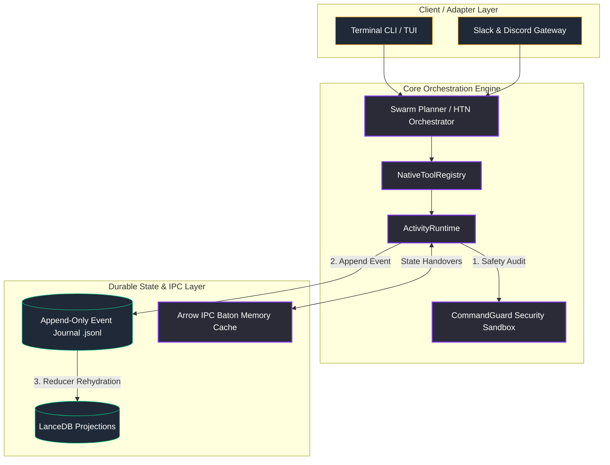
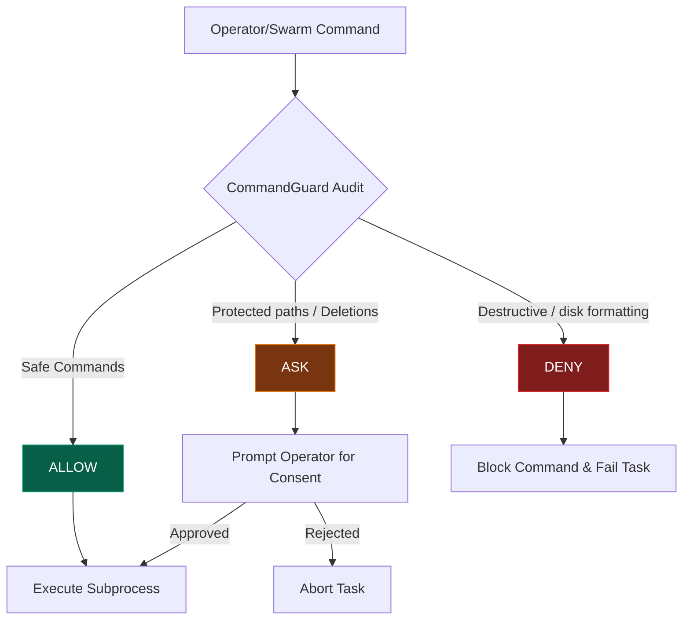

# AJA

**Your autonomous personal assistant — on your phone, your machines, and a $0 VPS, 24/7.**

[](https://opensource.org/licenses/MIT)
[](https://pyo3.rs/)
[](https://www.python.org/downloads/release/python-3120/)
[](https://arrow.apache.org/)
[](https://lancedb.github.io/lancedb/)

<!-- TODO: replace with real screenshot -->


```bash
git clone https://github.com/your-org/aja.git && cd aja && bash scripts/quickstart.sh
```

*Windows?* `.\scripts\quickstart.ps1` — clone-to-chat in about 10 minutes.

---

## What AJA Does For You

- 🌅 **Morning briefing on your phone** — overdue tasks, today's calendar, pending reminders, and priority focus in one structured message at 7:00 AM. ([Example 02](examples/02-daily-briefing.md))
- 🔎 **Web research with citations** — "find the current stable Python version" → AJA searches, reads the pages, and answers with sources. No browsing required. ([Example 01](examples/01-web-research.md))
- ⏰ **Reminders you say naturally** — "remind me to call the bank tomorrow at 9am." That's it. ([Example 03](examples/03-natural-reminders.md))
- 📅 **Calendar-aware scheduling** — connect Google Calendar once; briefings and planning respect your actual day. ([Setup guide](docs/operator/CALENDAR.md))
- 💻 **Code & sysadmin work on your repos** — coverage audits, dependency checks, server triage — executed safely under a command-security guard. ([Example 04](examples/04-code-analysis.md))
- ☁️ **Runs 24/7 on a free VPS** — scheduled monitoring pushes reports to Telegram; deploys via Docker to any ARM64/x64 host with zero inbound ports. ([Example 06](examples/06-scheduled-monitoring.md), [VPS runbook](docs/operator/VPS.md))

Every capability above is backed by a working walkthrough in [examples/](examples/README.md) and an automated test suite (800+ tests).

---

## Quick Start (~10 minutes)

1. **Clone**
   ```bash
   git clone https://github.com/your-org/aja.git && cd aja
   ```

2. **Run the quickstart script**
   ```bash
   bash scripts/quickstart.sh        # Linux / macOS
   .\scripts\quickstart.ps1          # Windows PowerShell
   ```
   The script creates a venv, installs AJA, walks you through creating a Telegram bot (token via [@BotFather](https://t.me/BotFather), your user ID via [@userinfobot](https://t.me/userinfobot)), writes `.env`, and validates everything with `aja doctor`.

3. **Message your bot** — start the daemon and chat from anywhere:
   ```bash
   aja serve
   ```
   Then send your bot a message: *"What's the latest stable Python version?"*

Prefer manual setup?
```bash
python -m aja setup     # interactive configuration wizard
python -m aja chat      # local interactive assistant loop
python -m aja doctor    # health + config validation
```

> [!NOTE]
> On Windows, install with `pip install -e ".[all]"` to get native ConPTY support (`pywinpty`); otherwise AJA falls back to standard pipe-based streams.

Full details: [docs/operator/INSTALL.md](docs/operator/INSTALL.md).

---

## Example Missions

Copy-pasteable walkthroughs, each completable in under 5 minutes.

| # | Mission | What you'll do |
|---|---------|----------------|
| 01 | [Web Research](examples/01-web-research.md) | Get a cited answer about the current Python release |
| 02 | [Daily Briefing](examples/02-daily-briefing.md) | Enable the 7 AM morning digest |
| 03 | [Natural Reminders](examples/03-natural-reminders.md) | Set reminders by chatting |
| 04 | [Code Analysis](examples/04-code-analysis.md) | Audit repo test coverage |
| 05 | [Dual-Model Split](examples/05-dual-model-split.md) | Cloud planner + free local GPU worker |
| 06 | [Scheduled Monitoring](examples/06-scheduled-monitoring.md) | Weekly website check → Telegram report |
| 07 | [Browser Automation](examples/07-browser-automation.md) | Playwright navigate/extract patterns |
| 08 | [Fleet Multi-Host](examples/08-fleet-multi-host.md) | Hand a mission between two hosts |

---

## Feature Matrix

| Capability | CLI / TUI | Telegram | Discord | Slack | Scheduled |
|------------|:--------:|:--------:|:-------:|:-----:|:---------:|
| Conversational assistant & mission launch | ✅ | ✅ | ✅ | ✅ | ✅ |
| Daily briefings | ✅ | ✅ | ✅ | ✅ | ✅ |
| Natural reminders | ✅ | ✅ | ✅ | ✅ | ✅ |
| Google Calendar sync | ✅ | ✅ | ✅ | ✅ | ✅ |
| Web research w/ citations | ✅ | ✅ | ✅ | ✅ | ✅ |
| Shell / code missions | ✅ | ✅ | ✅ | ✅ | ✅ |
| Browser automation (Playwright) | ✅ | ✅ | ✅ | ✅ | ✅ |
| Dual-model routing (cloud + local) | ✅ | ✅ | ✅ | ✅ | ✅ |
| Approval buttons for risky actions | — | ✅ | ✅ | ✅ | — |
| Multi-host fleet handover | ✅ | ✅ | ✅ | ✅ | ✅ |

---

## Deployment

### Local machine
Follow [Quick Start](#quick-start-10-minutes) — `aja serve` runs gateway adapters, the scheduler, and the autonomous goal loop in one process.

### Docker VPS (recommended for 24/7)
```bash
cp docker/.env.vps.example docker/.env   # fill TELEGRAM_BOT_TOKEN + TELEGRAM_ALLOWED_USER_IDS
docker compose -f docker/docker-compose.vps.yml build
docker compose -f docker/docker-compose.vps.yml up -d
```
Hardened image (non-root, cap-drop ALL, log rotation, healthcheck) with a slim ONNX embedding profile — no torch. Outbound-only polling means **zero inbound ports** besides SSH. Full runbook including host selection (Hetzner CAX11 vs Oracle Free Tier): [docs/operator/VPS.md](docs/operator/VPS.md).

### Fleet (multi-host)
Hand missions between your VPS and a home GPU worker via signed Arrow batons: [docs/operator/FLEET.md](docs/operator/FLEET.md).

Key environment variables (see [docker/.env.vps.example](docker/.env.vps.example)): `TELEGRAM_BOT_TOKEN`, `TELEGRAM_ALLOWED_USER_IDS` (mandatory on internet-facing hosts — without it the gateway fails safe and denies everyone), `COPILOT_GITHUB_TOKEN`, `AJA_BATON_SECRET`, `AJA_EMBEDDING_BACKEND`.

---

## Architecture

*For researchers and contributors.* AJA treats agentic workflows as long-running, durable compute processes rather than ephemeral chat loops, built on frontier agent research (**Bi-Temporal Knowledge Graphs**, **System-2 Test-Time Compute**, **CoALA 2.0**, **AIOS**, **CodeAct**, and **Stateless Model Context Protocol**).

AJA enforces a strict separation between orchestration, durable persistence, and execution transport:


```mermaid
graph TD
    classDef core fill:#2a2b36,stroke:#7c3aed,stroke-width:2px,color:#fff;
    classDef storage fill:#1f2937,stroke:#10b981,stroke-width:1px,color:#fff;
    classDef client fill:#1f2937,stroke:#f59e0b,stroke-width:1px,color:#fff;

    subgraph Client / Adapter Layer
        CLI[Terminal CLI / TUI]:::client
        Gateway[ Slack & Discord Gateway ]:::client
    end

    subgraph Core Orchestration Engine
        Orch[Swarm Planner / HTN Orchestrator]:::core
        Registry[NativeToolRegistry]:::core
        RT[ActivityRuntime]:::core
        Guard[CommandGuard Security Sandbox]:::core
    end

    subgraph Durable State & IPC Layer
        Journal[(Append-Only Event Journal .jsonl)]:::storage
        Projections[(LanceDB Projections)]:::storage
        Baton[Arrow IPC Baton Memory Cache]:::core
    end

    CLI --> Orch
    Gateway --> Orch
    Orch --> Registry
    Registry --> RT
    RT -->|1. Safety Audit| Guard
    RT -->|2. Append Event| Journal
    Journal -->|3. Reducer Rehydration| Projections
    RT <-->|State Handovers| Baton
```

* **Orchestration Layer**: Manages the deterministic sequencing of tasks and handles control flow, acting as the primary state machine.
* **Durable Activity Layer**: Wraps side-effecting code. During normal execution, it runs the code and journals the result. During recovery, it returns the journaled result without re-executing.
* **Journal & Replay Layer**: The append-only `.jsonl` event log acts as the absolute authority. The `EventRehydrator` replays this log to reconstruct state.
* **Projection Layer**: LanceDB read-projections are deterministically built from the journal. They serve fast state queries but hold no authority.
* **Execution Transport Layer**: Provides process isolation via PTY orchestration, safely running commands and capturing `stdout`/`stderr` lineage.
* **Rust Acceleration Layer**: Handles heavy serialization and state transport using Apache Arrow IPC batons, bypassing Python's GIL for core I/O.

### Why AJA Exists

Most autonomous agent frameworks are repository-bound IDE plugins or fragile prompt chains:

* **Repo-Locked Isolation**: Inability to manage the host system, inspect Docker daemons, or execute cross-project workflows.
* **Brittle Tool Schemas**: Multi-step JSON tool-calling loops that fail on complex calculations or data transformations.
* **Single-Store Memory Drift**: Storing exact system facts (ports, IPs) in vector databases where fuzzy matching causes hallucinations.
* **Crash Amnesia**: Workflows that restart from zero when an API call times out or a process crashes.

AJA inverts this paradigm with a robust, research-backed cognitive operating system.

### Key Design Features

| Feature | Description |
|---------|-------------|
| **Bi-Temporal Graph Memory** | Dual-timeline SQLite FTS5 knowledge graph (`valid_time` vs `transaction_time`) eliminating vector memory collisions. |
| **System-2 TTC Planner** | Test-Time Compute candidate branch exploration with state-tree snapshots and automatic failure backtracking. |
| **Autonomous Skill Compiler** | Self-evolution engine compiling successful mission trajectories into executable `agentskills.io` skills in `~/.aja/skills/`. |
| **Universal Stateless MCP Mesh** | Stateless MCP client supporting dynamic `tools/list` discovery and `maxTokenBudget` context safety. |
| **CodeAct Action Engine** | Direct Python & Bash execution with timeout traps, markdown extraction, and stdout/stderr capture. |
| **Tiered SOUL.md Architecture** | Custom global (`~/.aja/SOUL.md`) and project (`.aja/SOUL.md`) personas layered over `AGENTS.md` guidelines. |
| **Magentic-One Specialists** | Lead Cognitive Orchestrator directing specialized sub-agents: `SysAdmin`, `WebResearcher`, and `CodeEngineer`. |
| **Multi-Workspace Kernel** | Coroutine-isolated `WorkspaceContext`, dynamic registry (`~/.aja/workspaces.json`), and priority async mission queue. |
| **Replay-Authoritative Orchestration** | Append-only `.jsonl` journal is the single source of truth. All runtime state is a derived projection. |
| **Durable Activities** | Temporal-style activity context managers intercepting live execution and replaying historical results during recovery. |
| **Ambient & Sandboxed Security** | Ambient Host Mode for system-wide triage vs. Sandboxed Workspace Mode with hard non-bypassable catastrophic blocks. |
| **Rust Acceleration (PyO3/Arrow)** | Zero-copy inter-process communication for state transfer via Apache Arrow baton caches. |

### Durable Execution Model

The core invariant of AJA is **replay determinism**.


```mermaid
graph TD
    classDef allow fill:#065f46,stroke:#059669,stroke-width:1px,color:#fff;
    classDef ask fill:#78350f,stroke:#d97706,stroke-width:1px,color:#fff;
    classDef deny fill:#7f1d1d,stroke:#dc2626,stroke-width:1px,color:#fff;

    Command[Operator/Swarm Command] --> Guard{CommandGuard Audit}

    Guard -->|Safe Commands| Allow[ALLOW]:::allow
    Guard -->|Protected paths / Deletions| Ask[ASK]:::ask
    Guard -->|Destructive / disk formatting| Deny[DENY]:::deny

    Allow --> Run[Execute Subprocess]
    Ask --> Prompt[Prompt Operator for Consent]
    Prompt -->|Approved| Run
    Prompt -->|Rejected| Fail[Abort Task]
    Deny --> Block[Block Command & Fail Task]
```

1. **Event Sourcing**: When an execution step occurs, an event is atomically appended to the journal. The runtime state is then updated via a pure function reducer.
2. **Crash Recovery**: If the system crashes, AJA does not restart the workflow. Instead, it replays the journal.
3. **Durable Activities**: During replay, when the orchestrator encounters a previously completed side effect (e.g., a network call or shell command), the `ActivityContext` intercepts the call, prevents execution, and returns the historical result.
4. **Lineage Isolation**: Every task execution is strictly scoped. Output payloads, exit codes, and trace IDs are durably logged, ensuring perfect audibility.

### Cognitive Memory & Evaluation Systems

* **Short-Term Memory**: Conversation history (`aja_chat_history`) and RAM-cached, thread-safe baton transfer buffers enabling sub-millisecond execution handovers.
* **Episodic Memory**: Complete historical executions of tasks and tool outputs stored inside `core_tasks` and `core_tool_executions`.
* **Semantic Memory**: Cosine similarity goal-search over plan spaces using metadata-first SQL pre-filtering at the database layer.
* **Procedural Memory**: Rule triggers, strategy stores with temporal decay scoring, and failure post-mortem mapping to avoid repeating failed plan configurations.
* **Stability Guard**: Automatically disables planning learning if the rolling task success rate drops below 40%, isolating the planning engine from junk context loops.

### Repository Structure

```text
aja/
├── libs/
│   └── aja-core/               # Core Python Orchestration Runtime
│       ├── aja/runtime/        # Rehydrator, Journal, and Durable Activities
│       ├── aja/scheduler/      # Deterministic Cron Execution
│       └── aja/observability/  # TraceContextManager & Telemetry
├── packages/
│   └── aja-native/             # Rust acceleration layer (PyO3 + Apache Arrow)
├── examples/                   # Copy-pasteable capability walkthroughs
├── tests/
│   └── python/                 # Pytest suite ensuring replay determinism
├── docs/                       # Architecture specs and operator manuals
└── pyproject.toml              # Unified Maturin build manifest
```

### Development

Ensure you have Python 3.12+ and Rust installed:
```bash
pip install -e ".[dev]"
```

Testing — any change that breaks replay determinism is a failed build:
```bash
python -m pytest tests/python -n 8 --dist loadgroup --timeout=300
```

Operator tooling: `aja doctor` (host health + native modules), `aja rebuild-projections` (deterministic LanceDB rebuilds from the journal), `aja tui` (live curses HTN dashboard), and the strictly enforced `AJA_DATA_DIR` state boundary.

---

## Contributing

See [CONTRIBUTING.md](CONTRIBUTING.md) for development setup, test conventions, and the replay-certification philosophy.

---

## Roadmap

* **Replay Certification**: Formalized compliance tooling to verify older journals against newer schema definitions.
* **Snapshotting**: Periodic state snapshots to reduce replay time on infinitely running research daemons.
* **Deterministic Concurrency**: Multi-threaded durable activities with strictly ordered event interleaving.
* **Release Engineering**: Pre-compiled binary distributions for isolated installation without a local Rust toolchain.
* **Operational Hardening**: Granular network egress filtering and copy-on-write overlay filesystems for strict sandbox isolation.

---

## Acknowledgements

AJA draws architectural inspiration from modern durable execution systems like Temporal, robust event-sourced architectures, and the Dapr runtime philosophy.

---

## License

[MIT License](LICENSE)
