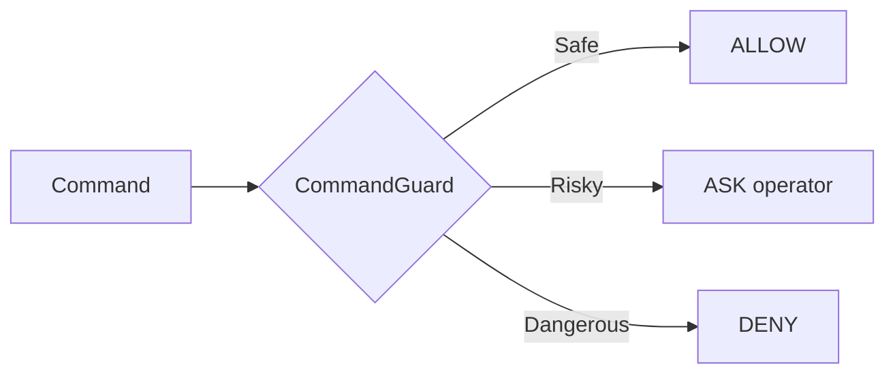
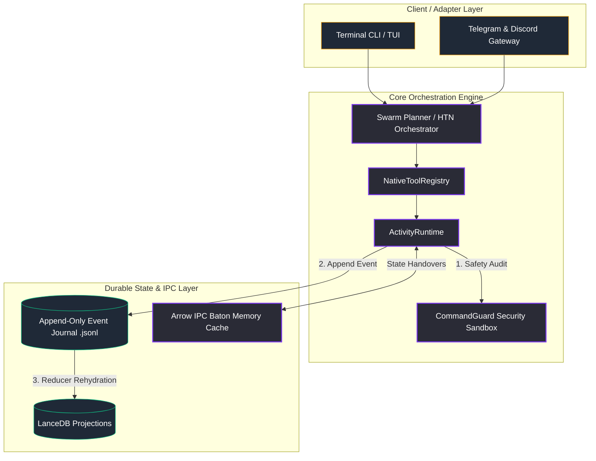

# AJA

**Your always-on personal AI assistant — on your phone, your machines, and a $0 VPS.**

[](LICENSE)
[]
[]
[]
[]

> Chat with AJA from your phone. It researches the web, manages your calendar,
> sets reminders, runs code on your servers, and delivers briefings every morning.
> Free to run — cloud reasoning + local GPU execution.

```
┌─ AJA ─────────────────────────────────────────────────────────┐
│                                                               │
│  You   what's the current stable python version?              │
│                                                               │
│  ⚙ search_web "python stable release"              0.8s      │
│    ↳ 5 results · fetching python.org/downloads     1.2s      │
│                                                               │
│  AJA   Python 3.13.2 is the current stable release,          │
│        released Oct 2024. Key changes: free-threaded         │
│        mode, incremental GC, and improved error msgs.        │
│        └ 📄 python.org/downloads                             │
│                                                               │
│  ▌                                                            │
└───────────────────────────────────────────────────────────────┘
```

```bash
git clone https://github.com/anixes/AJA.git && cd AJA && bash scripts/quickstart.sh
```

*Windows?* `.\scripts\quickstart.ps1` — clone-to-chat in about 10 minutes.

---

## What It Does

- 🌅 **Morning briefing on your phone** — overdue tasks, today's calendar, pending reminders, and priority focus in one structured message at 7:00 AM. → [Example 02](examples/02-daily-briefing.md)
- 💬 **Interactive Telegram Assistant** — continuous in-app typing pulse, instant read receipts (`👀` $\to$ `✅`), audio voice note transcription (Gemini / Whisper), document/code ingestion, and 1-tap local GPU GGUF management (`/local`). → [Telegram guide](docs/clients/TELEGRAM.md)
- 🔎 **Web research with citations** — "find the current stable Python version" → AJA searches, reads pages, and answers with sources. → [Example 01](examples/01-web-research.md)
- ⏰ **Reminders you say naturally** — "remind me to call the bank tomorrow at 9am." That's it. → [Example 03](examples/03-natural-reminders.md)
- 📅 **Calendar-aware scheduling** — connect Google Calendar once; briefings respect your actual day. → [Setup guide](docs/operator/CALENDAR.md)
- 💻 **Code & sysadmin work on your repos** — coverage audits, dependency checks, server triage — executed safely under a command-security guard. → [Example 04](examples/04-code-analysis.md)
- ☁️ **Runs 24/7 on a free VPS** — scheduled monitoring pushes reports to Telegram; deploys via Docker to any ARM64/x64 host with zero inbound ports. → [Example 06](examples/06-scheduled-monitoring.md) · [VPS runbook](docs/operator/VPS.md)

Every capability is backed by a working walkthrough in [examples/](examples/README.md) and an automated test suite (**960 tests**).

---

## Quick Start (~10 minutes)

1. **Clone**
   ```bash
   git clone https://github.com/anixes/AJA.git && cd AJA
   ```

2. **Run the quickstart script**
   ```bash
   bash scripts/quickstart.sh        # Linux / macOS
   .\scripts\quickstart.ps1          # Windows PowerShell
   ```
   Creates a venv, installs AJA, walks you through creating a Telegram bot (token via [@BotFather](https://t.me/BotFather), your user ID via [@userinfobot](https://t.me/userinfobot)), writes `.env`, and validates everything with `aja doctor`.

3. **Message your bot**
   ```bash
   aja serve
   ```
   Then send: *"What's the latest stable Python version?"*

<details>
<summary>Manual setup</summary>

```bash
python -m aja setup     # interactive configuration wizard
python -m aja chat      # local interactive assistant loop
python -m aja doctor    # health + config validation
```

</details>

> [!NOTE]
> On Windows, install with `pip install -e ".[all]"` for native ConPTY support (`pywinpty`). Otherwise AJA falls back to standard pipe-based streams.

Full details: [docs/operator/INSTALL.md](docs/operator/INSTALL.md)

---

## Example Missions

Copy-pasteable walkthroughs, each completable in under 5 minutes.

| # | Mission | What you'll do |
|---|---------|----------------|
| 01 | [Web Research](examples/01-web-research.md) | Get a cited answer about the current Python release |
| 02 | [Daily Briefing](examples/02-daily-briefing.md) | Enable the 7 AM morning digest |
| 03 | [Natural Reminders](examples/03-natural-reminders.md) | Set reminders by chatting |
| 04 | [Code Analysis](examples/04-code-analysis.md) | Audit repo test coverage |
| 05 | [Dual-Model Split](examples/05-dual-model-split.md) | Cloud planner + free local GPU worker |
| 06 | [Scheduled Monitoring](examples/06-scheduled-monitoring.md) | Weekly website check → Telegram report |
| 07 | [Browser Automation](examples/07-browser-automation.md) | Playwright navigate/extract patterns |
| 08 | [Fleet Multi-Host](examples/08-fleet-multi-host.md) | Hand a mission between two hosts |

---

## Feature Matrix

| Capability | CLI / TUI | Telegram | Discord | Scheduled |
|------------|:--------:|:--------:|:-------:|:---------:|
| Conversational assistant & mission launch | ✅ | ✅ | ✅ | ✅ |
| Daily briefings | ✅ | ✅ | ✅ | ✅ |
| Natural reminders | ✅ | ✅ | ✅ | ✅ |
| Google Calendar sync | ✅ | ✅ | ✅ | ✅ |
| Web research w/ citations | ✅ | ✅ | ✅ | ✅ |
| Shell / code missions | ✅ | ✅ | ✅ | ✅ |
| Browser automation (Playwright) | ✅ | ✅ | ✅ | ✅ |
| Dual-model routing (cloud + local) | ✅ | ✅ | ✅ | ✅ |
| Approval buttons for risky actions | — | ✅ | ✅ | — |
| Multi-host fleet handover | ✅ | ✅ | ✅ | ✅ |

> 🔜 Slack adapter is planned — the shared approvals engine makes it straightforward.

---

## Deployment

### Local machine
Follow [Quick Start](#quick-start-10-minutes) — `aja serve` runs everything in one process.

### Docker VPS (recommended for 24/7)
```bash
cp docker/.env.vps.example docker/.env   # fill TELEGRAM_BOT_TOKEN + TELEGRAM_ALLOWED_USER_IDS
docker compose -f docker/docker-compose.vps.yml build
docker compose -f docker/docker-compose.vps.yml up -d
```

Hardened image (non-root, cap-drop ALL, log rotation, healthcheck) with a slim ONNX embedding profile — no torch. Outbound-only polling means **zero inbound ports** besides SSH.

Full runbook including host selection (Hetzner CAX11 vs Oracle Free Tier): [docs/operator/VPS.md](docs/operator/VPS.md).

### Fleet (multi-host)
Hand missions between your VPS and a home GPU worker via signed Arrow batons: [docs/operator/FLEET.md](docs/operator/FLEET.md).

### Cost
AJA is designed to run at **$0/month**: cloud LLM calls are pay-per-token (pennies at personal scale), the local GPU worker uses hardware you already own, and the VPS fits within Oracle's or any free tier. Scheduled research and briefings run without human input.

Key environment variables (see [docker/.env.vps.example](docker/.env.vps.example)):
`TELEGRAM_BOT_TOKEN` · `TELEGRAM_ALLOWED_USER_IDS` (mandatory on internet-facing hosts — fails safe without it) · `COPILOT_GITHUB_TOKEN` · `AJA_BATON_SECRET` · `AJA_EMBEDDING_BACKEND`

---

## Security Model

AJA is designed to execute shell commands, browse the web, and manage files autonomously — so security is a first-class architectural concern, not an afterthought.

### CommandGuard

Every shell command passes through a three-tier classification before execution:


```mermaid
graph LR
    Command[Command] --> Guard{CommandGuard}
    Guard -->|Safe| Allow[ALLOW]
    Guard -->|Risky| Ask[ASK operator]
    Guard -->|Dangerous| Deny[DENY]
```

- **ALLOW**: read-only commands (`git status`, `ls`, `cat`) execute immediately
- **ASK**: risky commands (`rm -rf`, package installs) require explicit operator approval via inline buttons on Telegram/Discord
- **DENY**: catastrophic commands (`rm -rf /`, `mkfs`, fork bombs) are hard-blocked — no override

Permission scopes (`shell.read`, `shell.exec`, `web.read`, etc.) are enforced per-tool by a policy engine. See [docs/operator/VPS.md](docs/operator/VPS.md) for the fail-safe auth posture on internet-facing deployments.

### Durable Execution

AJA treats missions as long-running durable compute processes, not ephemeral chat loops:

1. Every execution step is atomically appended to an event journal
2. Runtime state is deterministically rebuilt from the journal via pure reducers
3. On crash recovery, previously completed side effects are replayed from the journal instead of re-executed
4. Every task has full lineage: output payloads, exit codes, and trace IDs are durably logged

This means AJA can crash, restart, or be deployed to a new host without losing mission state.

---

## Architecture

*For researchers and contributors.* AJA synthesizes frontier agent research (**Bi-Temporal Knowledge Graphs**, **System-2 Test-Time Compute**, **CoALA 2.0**, **AIOS**, **CodeAct**, and **Stateless Model Context Protocol**) into a practical runtime.

AJA enforces strict separation between orchestration, durable persistence, and execution transport:


```mermaid
graph TD
    classDef core fill:#2a2b36,stroke:#7c3aed,stroke-width:2px,color:#fff;
    classDef storage fill:#1f2937,stroke:#10b981,stroke-width:1px,color:#fff;
    classDef client fill:#1f2937,stroke:#f59e0b,stroke-width:1px,color:#fff;

    subgraph Client / Adapter Layer
        CLI[Terminal CLI / TUI]:::client
        Gateway[Telegram & Discord Gateway]:::client
    end

    subgraph Core Orchestration Engine
        Orch[Swarm Planner / HTN Orchestrator]:::core
        Registry[NativeToolRegistry]:::core
        RT[ActivityRuntime]:::core
        Guard[CommandGuard Security Sandbox]:::core
    end

    subgraph Durable State & IPC Layer
        Journal[(Append-Only Event Journal .jsonl)]:::storage
        Projections[(LanceDB Projections)]:::storage
        Baton[Arrow IPC Baton Memory Cache]:::core
    end

    CLI --> Orch
    Gateway --> Orch
    Orch --> Registry
    Registry --> RT
    RT -->|1. Safety Audit| Guard
    RT -->|2. Append Event| Journal
    Journal -->|3. Reducer Rehydration| Projections
    RT <-->|State Handovers| Baton
```

| Layer | Description |
|-------|-------------|
| **Orchestration** | Deterministic task sequencing and control flow state machine |
| **Durable Activities** | Wraps side-effecting code; replays journaled results during recovery |
| **Journal & Replay** | Append-only `.jsonl` event log as single source of truth; `EventRehydrator` reconstructs state |
| **Projections** | LanceDB read-projections deterministically built from journal; fast queries but no authority |
| **Execution Transport** | Process isolation via PTY orchestration; stdout/stderr lineage capture |
| **Rust Acceleration** | Heavy serialization and state transport via Apache Arrow IPC batons, GIL-free |

### Key Design Features

| Feature | Description |
|---------|-------------|
| **Bi-Temporal Graph Memory** | Dual-timeline SQLite FTS5 knowledge graph eliminating vector memory collisions |
| **System-2 TTC Planner** | Test-time compute candidate branch exploration with automatic failure backtracking |
| **Autonomous Skill Compiler** | Self-evolution engine compiling successful trajectories into executable skills |
| **Universal MCP Mesh** | Stateless MCP client supporting dynamic tool discovery and context safety |
| **CodeAct Action Engine** | Direct Python & Bash execution with timeout traps and output capture |
| **Multi-Workspace Kernel** | Coroutine-isolated workspace contexts with priority async mission queue |
| **Replay-Authoritative Orchestration** | Append-only journal is the single source of truth; all runtime state is derived |
| **Dual-Model Routing** | Cloud planner (reasoning quality) + local GPU worker (execution cost) coexist per-role |
| **Offline llama.cpp & GBNF** | Auto-detected GGUF models, CUDA auto-launcher, zero-RAM C++ vector embeddings, and strict GGML BNF grammar-constrained tool calling |
| **Autonomous Verification Gate** | OpenCode 2-style self-healing loop: AST syntax validation & automated test verification preventing premature completion |
| **Zed & JetBrains ACP Protocol** | Native Agent Client Protocol (`aja acp`) JSON-RPC stdio server for in-editor AI agent control and dynamic `@` context grounding |

### Repository Structure

```text
aja/
├── libs/
│   └── aja-core/               # Core Python orchestration runtime
│       ├── aja/core/           # ConversationCore (unified chat brain)
│       ├── aja/runtime/        # Rehydrator, journal, durable activities
│       ├── aja/scheduler/      # Deterministic cron execution
│       ├── aja/gateway/        # Platform adapters (Telegram, Discord)
│       └── aja/observability/  # TraceContextManager & telemetry
├── packages/
│   └── aja-native/             # Rust acceleration layer (PyO3 + Arrow)
├── examples/                   # Copy-pasteable capability walkthroughs
├── tests/python/               # Pytest suite (911 tests)
├── docs/                       # Architecture specs and operator manuals
└── pyproject.toml              # Unified maturin build manifest
```

### Development

```bash
pip install -e ".[dev]"
python -m pytest tests/python -n 8 --dist loadgroup --timeout=420
```

Any change that breaks replay determinism is a failed build.

Operator tooling: `aja doctor` (health + config), `aja healthcheck --quick` (container liveness), `aja tui` (dashboard).

---

## Contributing

See [CONTRIBUTING.md](CONTRIBUTING.md) for development setup, test conventions, and the replay-certification philosophy.

---

## Roadmap

- **Slack adapter parity** — shared approvals engine makes this straightforward
- **Anthropic native conformance** — base URL registered; needs key for testing
- **Replay viewer** — browsable UI for past mission journals
- **Performance profiling** — real-mission benchmarks against established baselines
- **WhatsApp bridge** — deferred pending safe-path evaluation (official Meta Cloud API requires public webhook endpoint)

---

## Acknowledgements

AJA draws architectural inspiration from modern durable execution systems like Temporal, robust event-sourced architectures, and the Dapr runtime philosophy.

---

## License

[MIT License](LICENSE)
