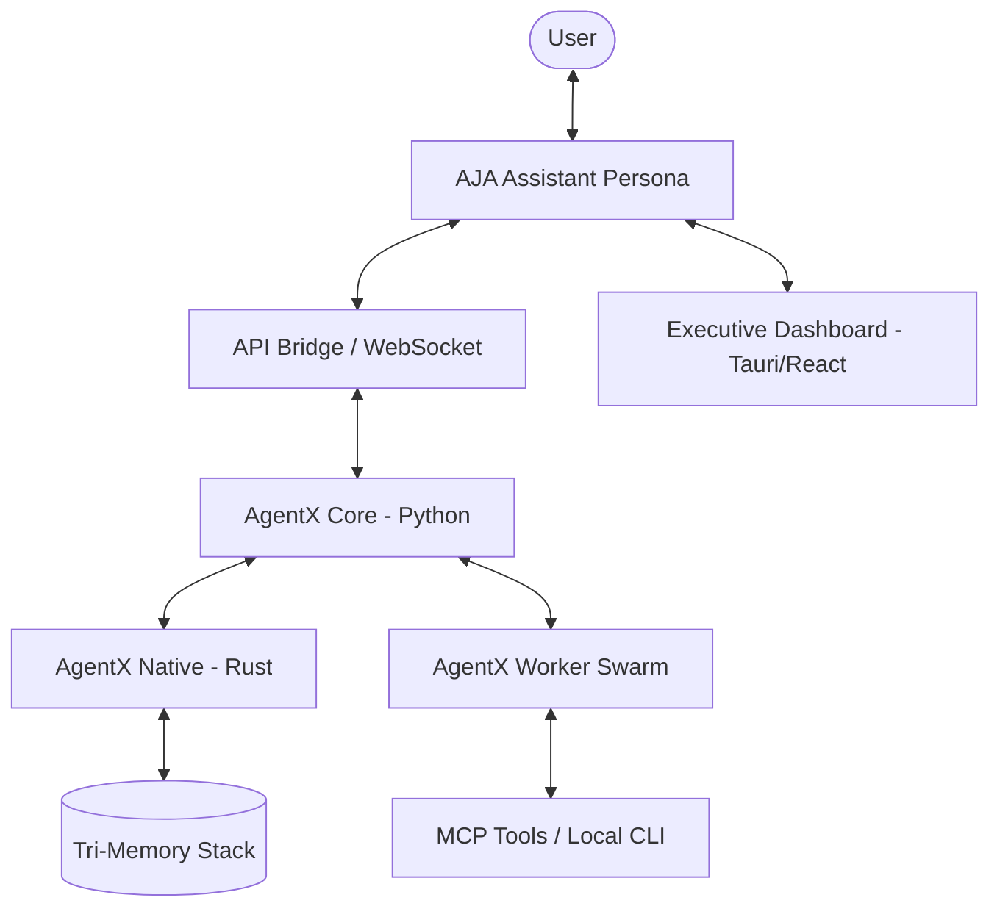

# AgentX Architecture: Tri-Memory Stack

AgentX is a high-performance, local-first agentic system engineered to run on every machine—from high-end servers to the **cheapest of consumer hardware**. By utilizing a cutting-edge **Tri-Memory Stack**, AgentX delivers elite autonomy with maximum efficiency. The entire system is built on **Apache Arrow**, ensuring zero-copy performance across all layers.

---

## 1. System Overview

AgentX follows a **Sovereign Agent** architecture where a central Assistant (**AJA**) orchestrates a swarm of specialized workers.

---

## 2. The Tri-Memory Stack

### A. LanceDB (The Persistent Brain)
**Storage Location:** `.agentx/`
- **Purpose**: Authoritative long-term memory.
- **Components**: `core_tasks`, `skill_store`, `decision_metrics`.
- **Performance**: Columnar retrieval using Arrow IPC fragments.

### B. Arrow IPC (The Reflexive Nerves)
**Storage Location:** `.agentx/batons/*.arrow`
- **Purpose**: Ultra-low latency handovers (Batons).
- **Strategy**: Memory-mapped zero-copy transfers between Python and Rust.

### C. JSON/SQLite (The Operating Vitals)
**Storage Location:** `agentx.json`, `.agentx/aja_secretary.sqlite3`
- **Purpose**: Human-readable configuration and secretary-level persistence for task states.

---

## 3. Core Components

### `agentx-core` (Python)
- **Role**: High-level orchestration, LLM interfacing, and persona management.
- **Key Modules**:
    - `main.py`: CLI entry point and interactive loop.
    - `api/bridge.py`: WebSocket server for dashboard telemetry.
    - `agents/`: Swarm logic and base agent classes.
    - `utils/agentx_guard.py`: The safety gate and command auditor.

### `agentx-native` (Rust)
- **Role**: Performance-critical operations.
- **Key Modules**:
    - `tokenizers`: Fast tiktoken-based encoding.
    - `lancedb`: Native integration with the vector store.
    - `ipc`: Arrow IPC memory-mapping logic.

### `apps/dashboard` (React)
- **Role**: Visual observability and mission control.
- **Key Features**: Live priority engine, worker registry, and mission audit logs.

---

## 4. Conventions

- **Data Exchange**: All complex data structures MUST be passed as Arrow-compatible buffers or JSON.
- **Safety First**: No terminal command executes without passing through the **AJA Guard** (CommandStripper logic).
- **Local-First**: External APIs are used only for LLM inference; all memory and state are stored on the local filesystem.

---
*Generated by /codebase-mapper on 2026-05-12*
