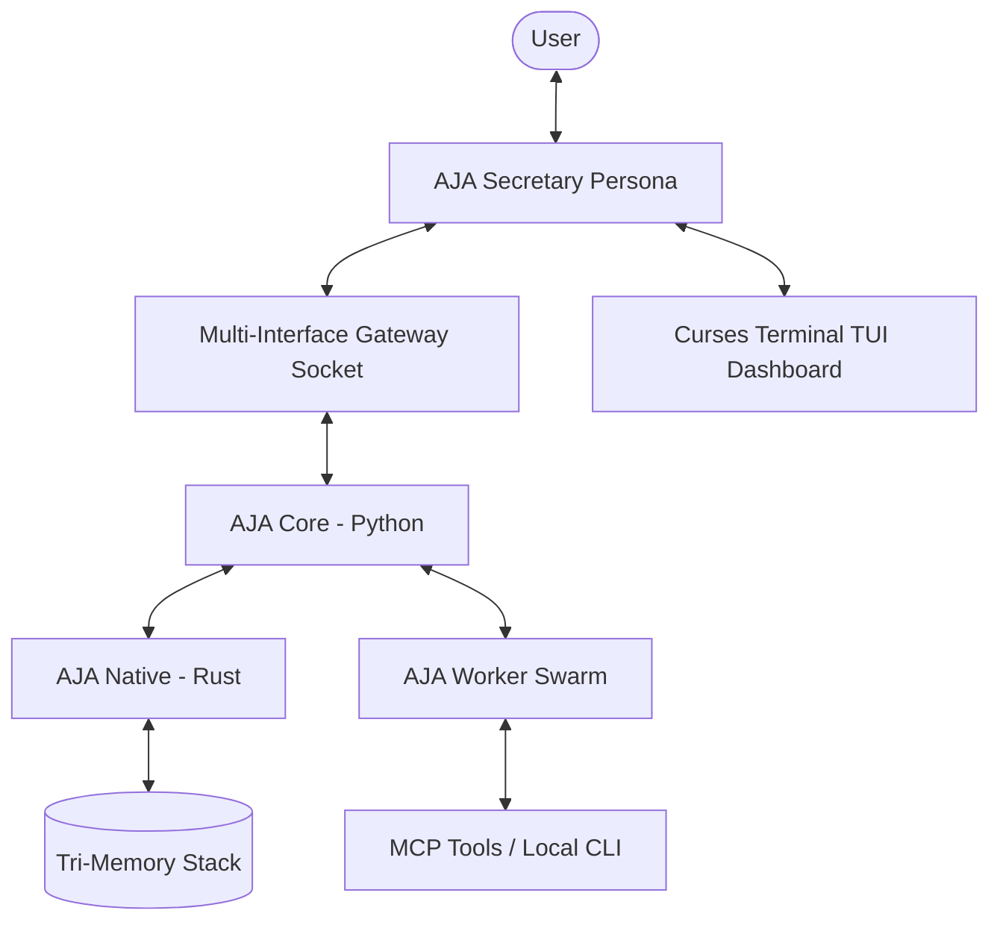

# AJA Architecture: Tri-Memory Stack
### *Featuring AJA: Assistant of Joint Agents*

AJA is a high-performance, local-first orchestration core engineered to run on every machine—from high-end servers to standard consumer hardware. By utilizing a cutting-edge **Tri-Memory Stack**, AJA delivers elite autonomy with maximum efficiency. The entire system is built on **Apache Arrow**, ensuring zero-copy performance across all layers.

> **Runtime**: Always use global Python 3.12.10 at `C:\Users\Asus\AppData\Local\Programs\Python\Python312\python.exe`

---

## 1. System Overview

AJA follows a **Sovereign Agent** architecture where a central Assistant (**AJA**) orchestrates a swarm of specialized workers.



---

## 2. The Tri-Memory Stack

### A. LanceDB (The Persistent Brain)
**Storage Location:** `.aja/lancedb/`
- **Purpose**: Authoritative long-term memory and project context.
- **Components**: `core_tasks`, `core_tool_executions`, `core_plans` (384D vectors), `core_triggers`, `aja_chat_history`, `territory_knowledge`, `self_evolve_knowledge`.
- **Performance**: Columnar retrieval and vector similarity search via `sentence-transformers`.

### B. Arrow IPC (The Reflexive Nerves)
**Storage Location:** `.aja/batons/*.arrow`
- **Purpose**: Ultra-low latency handovers (Batons).
- **Strategy**: Memory-mapped zero-copy transfers between Python and Rust.
- **Trace Propagation**: Active `trace_id` values are serialized into Arrow metadata headers during capture and restored automatically during pickup, enabling full distributed tracing across baton handovers.

### C. Config & Metrics (The Operating Vitals)
**Storage Location:** `.aja/*.json`, `telegram-history.jsonl`, `.aja/security_audit.log`
- **Purpose**: Readable configuration, auxiliary telemetry logs, and structured security audit records.

---

## 3. Core Components

### `aja-core` (Python)
- **Role**: High-level orchestration, LLM interfacing, and terminal-first local persona management.
- **Key Modules**:
    - `main.py`: CLI entry point with `setup`, `doctor`, `run`, `chat`, `status`, `memory`, and `tui` subcommands.
    - `api/interfaces.py`: Pluggable Abstract Base Classes (`BaseModelProvider` and `BaseTool`) allowing developers to extend custom LLM providers and actions seamlessly.
    - `gateway/gateway_runner.py`: Session broker managing multi-adapter communication channels (Slack SocketMode, Discord bot, Telegram socket adapters).
    - `scheduler/cron_scheduler.py`: Persistent task scheduler executing HTN swarm goals directly out of LanceDB with standard 5-field cron parsing and a hard 3-minute interrupt limit.
    - `tui/curses_tui.py`: Premium standard-library Curses live dashboard supporting multi-skin color palettes (`cyberpunk`, `ares`, `default`) rendering live plan tree states, system metrics, and tailings logs.
    - `config.py` + `config_schema.py`: Pydantic v2 schema validation on every import. Invalid configs fall back to safe defaults.
    - `observability/telemetry.py`: `TraceContextManager` with contextvar-local trace ID propagation across threads and async tasks.
    - `runtime/handover.py`: `BatonManager` with Apache Arrow metadata serialization, now supporting horizontally scaled base64 network transfers.
    - `utils/diagnostics.py`: Comprehensive systems doctor (config, native engine, LanceDB, API keys, system resources).
    - `orchestration/swarm.py`: Swarm engine with `--dry-run` simulation and `AJAGuard` safety auditing.
    - `agents/`: Swarm logic and base agent classes.
    - `utils/agentx_guard.py`: The safety gate and command auditor.

### `aja-native` (Rust)
- **Role**: Performance-critical GIL-free operations.
- **Key Modules**:
    - `tokenizers`: Fast tiktoken-based encoding.
    - `lancedb`: Native integration with the vector store.
    - `ipc`: Arrow IPC memory-mapping logic (`write_baton` / `read_baton`).

---

## 4. Product-Readiness & Architectural Upgrades (Updated 2026-05-22)

| Capability | Module | Status | Description |
|---|---|---|---|
| Pydantic config validation | `aja/config_schema.py`, `aja/config.py` | ✅ Live | Standard validation schemas for system settings |
| Trace-aware context manager | `aja/observability/telemetry.py` | ✅ Live | Propagates thread-safe active task trace IDs |
| Arrow Baton trace propagation | `aja/runtime/handover.py` | ✅ Live | Serializes active tracing headers inside IPC batons |
| Systems diagnostics doctor | `aja/utils/diagnostics.py` | ✅ Live | System resources audit checks via `/doctor` |
| Guided setup wizard | `aja/main.py` (`setup`) | ✅ Live | Wizard prompts scaffolding standard workspace layout |
| Dry-run safe simulation | `aja/orchestration/swarm.py` | ✅ Live | Audits planned terminal commands via dry-run simulation |
| Pluggable Model/Tool ABCs | `aja/api/interfaces.py` | ✅ Live | Decoupled model provider subclasses and base tools |
| Multi-Interface Gateway | `aja/gateway/gateway_runner.py` | ✅ Live | Continuous chat broker managing Slack and Discord bot sessions |
| Persisted Cron Scheduler | `aja/scheduler/cron_scheduler.py` | ✅ Live | Recurring HTN swarm ticker with LanceDB and timeout safety |
| Curses TUI Live Dashboard | `aja/tui/curses_tui.py` | ✅ Live | Terminal three-pane layout featuring dynamic color skins |
| Distributed Network Batons | `aja/runtime/handover.py` | ✅ Live | Network-scalable GIL-free batons via base64 Arrow IPC |
| Hacker-Butler Conversational Persona | `aja/api/bridge.py`, `aja/interface/intent_parser.py`, `aja/gateway/orchestrator.py` | ✅ Live | Polite, developer-fluent secretary and proactive coordinator |
| Pure Local-First Focus | `apps/dashboard` DELETED | 🗑️ Stripped | Removed React Web UI frontend, simplifying worker spawners |

---

## 5. Conventions

- **Data Exchange**: All complex data structures MUST be passed as Arrow-compatible buffers or JSON.
- **Safety First**: No terminal command executes without passing through the **AJA Guard** (`CommandStripper` logic).
- **Local-First**: External APIs are used only for LLM inference; all memory and state are stored on the local filesystem. We rely on standard keyboard shortcuts and curses TUIs rather than bulky background browser dashboard scripts.
- **Python Runtime**: Always use global Python 3.12.10. Do **not** use Anaconda Python.
- **Async Patterns**: Use `anyio.create_task_group()` (not `asyncio.gather`) for backend-agnostic task concurrency in tests and gateway adapter modules.
- **Soft Dependencies**: External packages like `psutil` must be imported with graceful stdlib fallbacks.

---

## 6. Test Suite

Run the full test suite under global Python 3.12:
```powershell
$env:PYTHONPATH="libs/aja-core"; & "C:\Users\Asus\AppData\Local\Programs\Python\Python312\python.exe" -m pytest tests/python
```
**Current Status**: `142 passed, 1 warning` (Python 3.12.10, pytest-9.0.3)

| Test File | Coverage Area |
|---|---|
| `test_config_validation.py` | Pydantic schema enforcement |
| `test_trace_telemetry.py` | Thread/async trace isolation + Arrow Baton round-trip |
| `test_agentx_hardening.py` | Core safety hardening |
| `test_handover_mmap.py` | Memory-mapped Arrow baton handovers |
| `test_worker_registry.py` | Swarm worker registration |
| `test_tui.py` | Curses terminal viewport rendering & skin layout styles |
| `test_cron_scheduler.py` | Persistent cron matching tasks & 3-minute hard timeouts |
| `test_remote_handover.py` | Remote network-scalable base64 Arrow baton transmissions |
| `planning/test_dag_*.py` | HTN DAG validation & healing |
| `planning/test_replanner.py` | Adaptive replanning logic |
| `planning/test_scheduler.py` | Execution scheduler |

---
*Architecture updated 2026-05-22 — Phase 1 Architectural Upgrades & Web UI Deprecation applied.*
