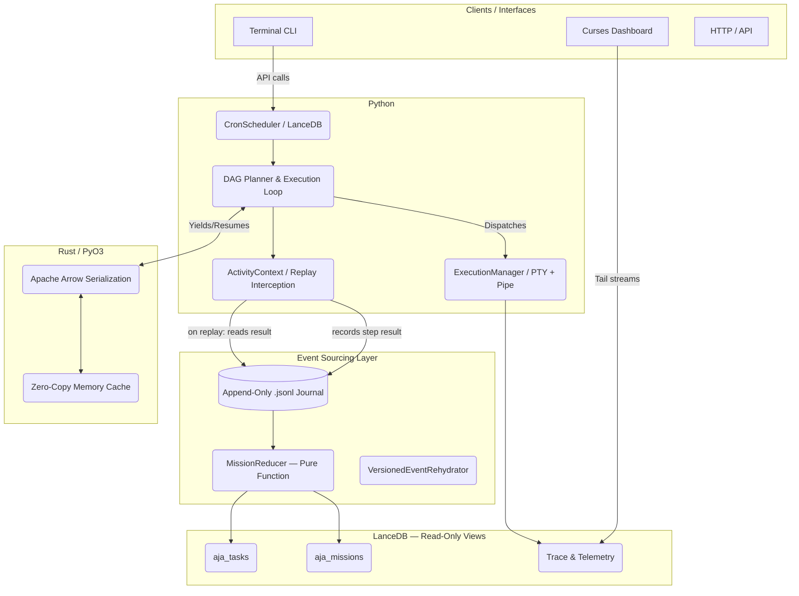

# Architecture Overview

AJA Runtime is a local-first orchestration runtime and execution substrate. This document describes the high-level system topology and the fundamental design decisions underlying the architecture.

> **V1 Certified** — replay-authoritative event-sourced architecture. 223 tests green.

---

## System Topology

AJA enforces a strict separation between the **Runtime Engine** (which owns state, execution, and persistence), the **Event Journal** (which is the single source of truth), and **Clients** (which handle presentation and user interfaces).



---

## Event-Sourcing Architecture

### The Journal is the Source of Truth

All mission and task state originates from the **append-only `.jsonl` event journal**. LanceDB tables are **read-projections** derived from the journal — they are never authoritative.

```
Event Occurs
    │
    ▼
journal.append(event)          ← Always first, atomic write
    │
    ▼
reducer.apply(event, state)    ← Pure function, no side effects
    │
    ▼
projection.upsert(new_state)   ← LanceDB read-projection update
```

**Key invariants:**
1. No event is ever mutated or deleted from the journal.
2. The `MissionReducer` is a pure function: `(events[]) → state`.
3. `aja rebuild-projections` can always reconstruct all LanceDB tables from scratch.

### Durable Activity Execution

`ActivityContext` (a `ContextVar`-based manager) wraps each execution step:
- In **live mode**: executes the step, records result in the journal, returns result.
- In **replay mode**: reads the stored result from the journal, returns it without re-executing.
- On **divergence**: raises `ReplayDivergenceError` — the runtime fails fast rather than silently lying.

This provides Temporal-style durable execution semantics without an external workflow engine dependency.

### Schema Versioning

Every journal event carries a `schema_version` field. The `VersionedEventRehydrator` in `event_schema.py` handles forward-compatibility migrations, ensuring old journals replay correctly after schema upgrades.

---

## Hybrid Rust/Python Design Philosophy

AJA is built as a hybrid runtime to maximize both performance and developer velocity.

### What Python Owns (`libs/aja-core`)
Python owns high-level I/O operations, orchestration logic, the `asyncio` event loop, shell semantics (via `subprocess`), and the event journal.
- **Rationale**: Python provides rapid iteration capabilities for API integrations, client adapters, complex async scheduling (`aja/scheduler/cron_scheduler.py`), and event-sourcing infrastructure.

### What Rust Owns (`libs/aja-native`)
Rust owns state serialization (Apache Arrow), PyO3 IPC boundaries, high-throughput memory mapping, and trajectory compression.
- **Rationale**: Moving massive LLM multi-turn conversation memory between processes causes unacceptable latency in Python due to serialization/deserialization overhead and the GIL. By leveraging Rust and Arrow (`aja/runtime/handover.py`), AJA achieves zero-copy, O(1) state transfer overhead.

---

## Core Directives

1. **Event Journal Supremacy**: The `.jsonl` journal is immutable and authoritative. LanceDB tables are projections only.
2. **Explicit Data Ownership**: No global mutable state exists outside the journal and the strictly-locked `_IN_MEMORY_BATONS` buffer.
3. **Protocolized Persistence**: The orchestration engine does not know about LanceDB; it speaks to a `RuntimeTaskStore` protocol.
4. **Deterministic Constraints**: Tasks are bounded by time (hard 3-minute timeouts) and resources (sandbox constraints). Nondeterminism introduced by LLM planners is caged by the deterministic runtime loop. See [Resource Governance](file:///d:/AgenticAI/Project1(no-name)/docs/architecture/GOVERNANCE.md) for enforcement details.
5. **Fail-Fast Divergence**: Any mismatch between live execution and journal replay is a `ReplayDivergenceError` — the system never silently lies about state.
