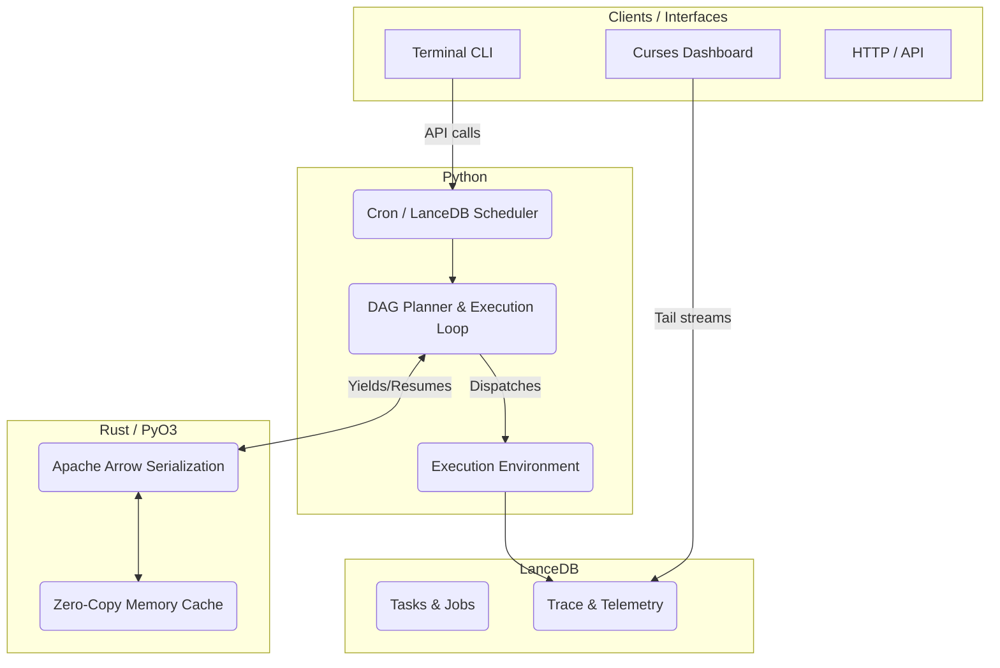

# Architecture Overview

AJA Runtime is a local-first orchestration runtime and execution substrate. This document describes the high-level system topology and the fundamental design decisions underlying the architecture.

## System Topology

AJA enforces a strict separation between the **Runtime Engine** (which owns state, execution, and persistence) and **Clients** (which handle presentation and user interfaces).

## Hybrid Rust/Python Design Philosophy

AJA is built as a hybrid runtime to maximize both performance and developer velocity.

### What Python Owns (`libs/aja-core`)
Python owns high-level I/O operations, orchestration logic, the `asyncio` event loop, and shell semantics (via `subprocess`). 
- **Rationale**: Python provides rapid iteration capabilities for API integrations, client adapters, and complex asynchronous scheduling (`aja/scheduler/cron_scheduler.py`).

### What Rust Owns (`libs/aja-native`)
Rust owns state serialization (Apache Arrow), PyO3 IPC boundaries, high-throughput memory mapping, and trajectory compression.
- **Rationale**: Moving massive LLM multi-turn conversation memory between processes causes unacceptable latency in Python due to serialization/deserialization overhead and the Global Interpreter Lock (GIL). By leveraging Rust and Arrow (`aja/runtime/handover.py`), AJA achieves zero-copy, O(1) state transfer overhead.

## Core Directives

1. **Explicit Data Ownership**: No global mutable state exists outside of the LanceDB stores and the strictly-locked `_IN_MEMORY_BATONS` buffer.
2. **Protocolized Persistence**: The orchestration engine does not know about LanceDB; it speaks to a `RuntimeTaskStore` protocol.
3. **Deterministic Constraints**: Tasks are bounded by time (e.g., hard 3-minute timeouts) and resources (sandbox constraints). Nondeterminism introduced by LLM planners must be caged by the deterministic runtime loop.
