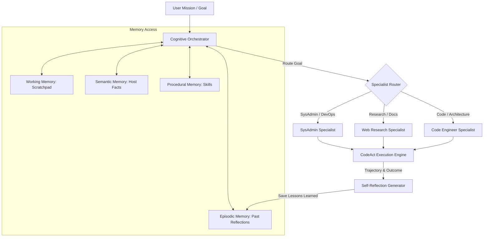

# Cognitive Architecture: Autonomous Agent OS

AJA incorporates a state-of-the-art cognitive runtime synthesizing peer-reviewed research in cognitive architectures, operating systems for language agents, executable action spaces, and multi-agent coordination.

---

## 1. Research Foundations

AJA's cognitive layer is built on four core academic pillars:

1. **CoALA** (*Cognitive Architectures for Language Agents* - Princeton / Stanford / CMU):
   - Establishes a tripartite memory model separating **Working Memory** (fast scratchpad), **Semantic Memory** (persistent environment facts), **Episodic Memory** (experiential trajectory reflections), and **Procedural Memory** (executable skills).
2. **AIOS** (*LLM Agent Operating System* - Rutgers):
   - Implements an operating system kernel abstraction for LLM agents: priority scheduling, context budgeting, and access control over host resources.
3. **CodeAct** (*Executable Code Actions Elicit Better LLM Agents* - ICML 2024):
   - Replaces brittle JSON tool-calling schemas with executable Python and Bash action blocks, allowing the agent to dynamically calculate, transform, filter, and orchestrate complex tools in code.
4. **Magentic-One** (*Microsoft Research*):
   - Multi-agent orchestration pattern where a lead Cognitive Orchestrator directs specialized sub-agents (`SysAdmin`, `WebResearcher`, `CodeEngineer`) tailored with domain prompts and toolsets.

---

## 2. Memory Substrates (The CoALA Tripartite Model)

AJA avoids using a single database as a catch-all memory store. Instead, each memory type is assigned to its optimal storage substrate:

```
┌─────────────────────────────────────────────────────────────────────────────┐
│                       AJA COGNITIVE MEMORY STACK                            │
├───────────────────┬─────────────────────────┬───────────────────────────────┤
│ Memory Substrate  │ Storage Medium          │ Primary Function              │
├───────────────────┼─────────────────────────┼───────────────────────────────┤
│ Working Memory    │ Coroutine RAM / Context │ Sub-goals, hypotheses,        │
│                   │                         │ observation scratchpad        │
├───────────────────┼─────────────────────────┼───────────────────────────────┤
│ Semantic Memory   │ JSON / SQLite KV        │ Host environment facts, IPs,  │
│                   │                         │ specs, configurations ($O(1)$)│
├───────────────────┼─────────────────────────┼───────────────────────────────┤
│ Episodic Memory   │ LanceDB Vector Tables   │ Trajectory post-mortems,      │
│                   │                         │ vector similarity recall      │
├───────────────────┼─────────────────────────┼───────────────────────────────┤
│ Procedural Memory │ Filesystem Tree         │ Executable Python/Bash skills │
│                   │ (`~/.aja/skills/`)      │ (agentskills.io standard)     │
└───────────────────┴─────────────────────────┴───────────────────────────────┘
```

### A. Working Memory (`WorkingMemory`)
- Lives in volatile, coroutine-isolated memory (`ContextVar`).
- Tracks the active mission goal, sub-goal stack, scratchpad thoughts, and immediate tool observations.
- Uses sliding window compaction to avoid context window degradation during long-running tasks.

### B. Semantic Memory (`SemanticFact`)
- Stored deterministically in `~/.aja/state/semantic.json` or SQLite.
- Auto-discovers and maintains exact host facts: OS version, CPU cores, RAM, active user, network interfaces, and container daemons.
- Avoids semantic drift and fuzzy matching errors common in pure vector search.

### C. Episodic Memory (`EpisodeReflection`)
- Stored in LanceDB vector tables (`aja_episodic_reflections`).
- Encapsulates past task trajectories, key lessons learned, error post-mortems, and successful strategies.
- Queried via cosine similarity to recall relevant past experiences before generating plans.

### D. Procedural Memory (`ProceduralSkill`)
- Stored in standard directory trees (`~/.aja/skills/<skill_name>/`).
- Adheres to the open **agentskills.io** format (`SKILL.md` frontmatter + markdown documentation + executable Python/Bash scripts).
- Directly version-controlled with Git and executable on the host.

---

## 3. CodeAct Unified Action Space

Traditional agent architectures force LLMs into multi-turn JSON tool-calling loops. This results in heavy token waste and frequent schema parsing errors.

AJA implements **CodeAct (ICML 2024)**:
- The agent outputs standard Python or Bash markdown blocks:
  ```python
  # CodeAct: direct Python execution
  import json
  from aja.orchestration.tools.sys_tools import get_system_specs
  
  specs = get_system_specs()
  print(f"Host CPU: {specs['cpu_count']}, Memory: {specs['total_memory_gb']} GB")
  ```
- **Execution Traps**: Python code is executed in isolated subprocesses with configurable timeout traps (`CodeActExecutor`).
- **Standard Streams**: `stdout` and `stderr` are captured cleanly and returned as structured observations into the agent's working memory.

---

## 4. Magentic-One Specialist Roles

The `CognitiveOrchestrator` delegates tasks to specialized personas:



1. **`SysAdminSpecialist`**:
   - Focused on host diagnosis, Docker container triage, disk/RAM inspections, service status, and log audits.
   - Utilizes `sys_tools.py` (`get_system_specs`, `inspect_docker_containers`, `get_active_ports`).
2. **`WebResearchSpecialist`**:
   - Focused on live documentation lookup, technical article synthesis, and API reference retrieval.
   - Utilizes `web_tools.py` (`search_web`, `fetch_url`).
3. **`CodeEngineerSpecialist`**:
   - Focused on code authoring, test execution (`pytest`), architectural refactoring, and bug fixes.

---

## 5. Ambient Security vs. Workspace Sandboxing

AJA supports dual operating modes governed by `aja.security.command_guard`:

1. **Ambient Host Mode (Default)**:
   - When no specific isolated project workspace is bound, AJA acts as a general-purpose host companion.
   - Allows access across user home directories (`~`) for system administration and general coding.
2. **Workspace Sandboxed Mode**:
   - When bound to a specific workspace (`aja ws use <name>`), all file access and tool executions are strictly pinned to the project root.
   - Out-of-bounds path traversals (`../`, `/etc/`, absolute paths) are blocked or gated for operator authorization.
3. **Non-Bypassable Catastrophic Block**:
   - In both modes, destructive operations (`rm -rf /`, `mkfs`, `format`, `dd`, fork bombs) are blocked unconditionally at Layer 1 in `<1ms`.
